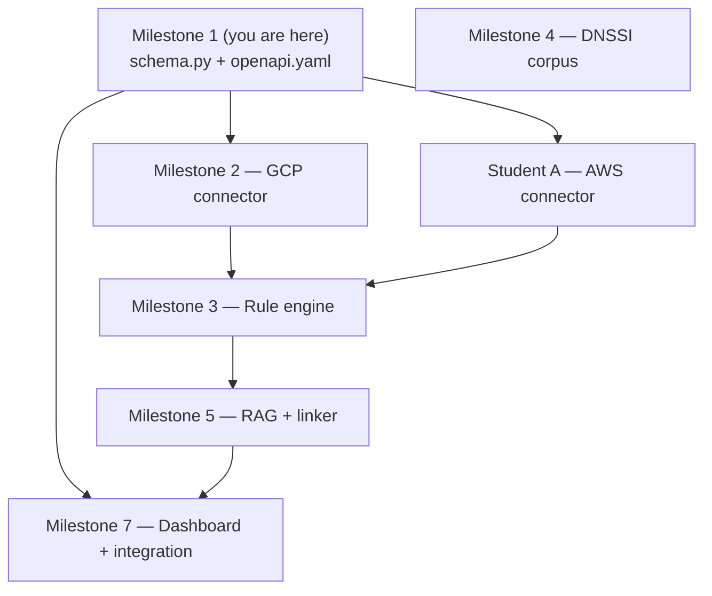
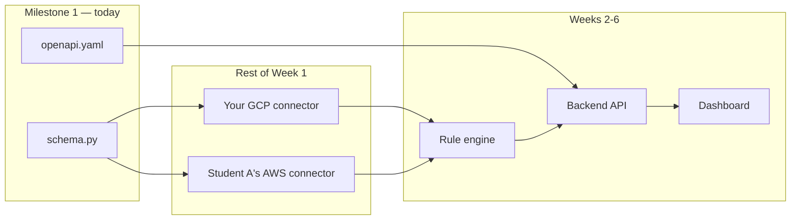
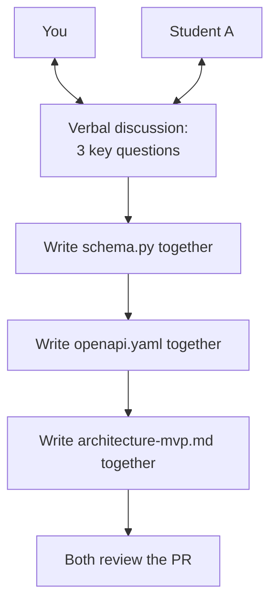
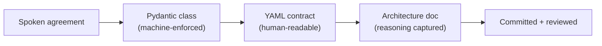
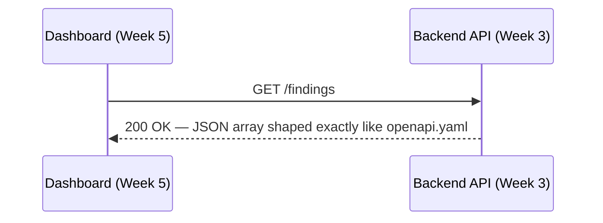
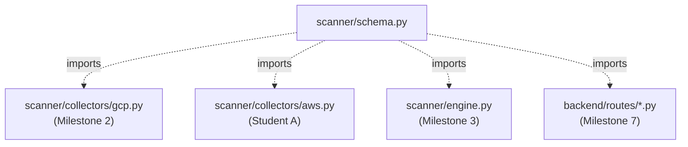
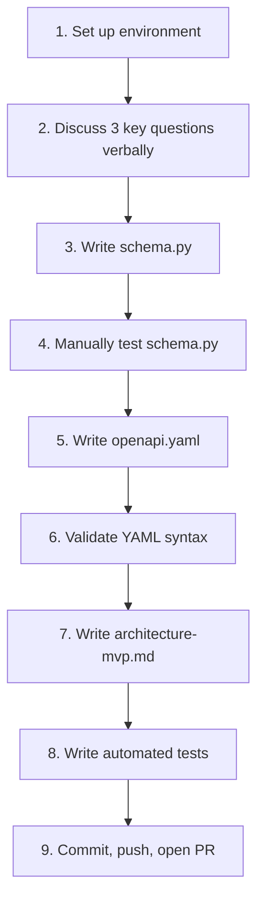
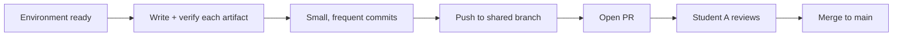
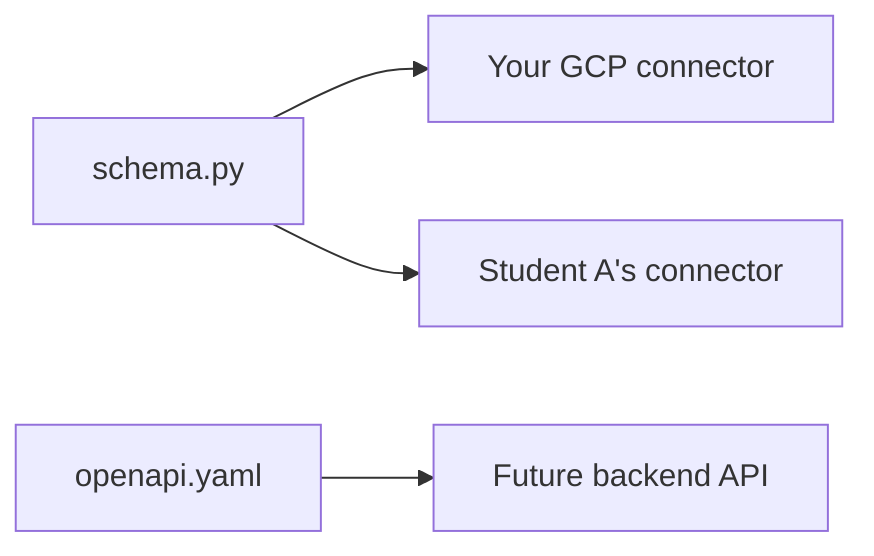

# 🎯 Milestone 1 Mastery Guide
### Student B — Freezing the Shared Schema & API Contract

> Companion to your **Student B Compass**. Where the Compass gave you the map, this guide walks the first mile
> with you, step by step, until you can defend every decision in it without notes.

---

## 📖 Table of contents

1. [Understanding the milestone](#chapter-1--understanding-the-milestone)
2. [Learning everything I need first](#chapter-2--learning-everything-i-need-first)
3. [Visual architecture](#chapter-3--visual-architecture)
4. [Preparing my development environment](#chapter-4--preparing-my-development-environment)
5. [Step-by-step implementation](#chapter-5--step-by-step-implementation)
6. [Thinking like an engineer](#chapter-6--thinking-like-an-engineer)
7. [Git workflow](#chapter-7--git-workflow)
8. [Testing](#chapter-8--testing)
9. [End-of-milestone review](#chapter-9--end-of-milestone-review)

---

## Chapter 1 — 🧩 Understanding the milestone

### What is this milestone, exactly?

Milestone 1 produces exactly three artifacts, agreed jointly with Student A:

1. `scanner/schema.py` — a Pydantic class called `NormalizedResource`, defining the *one* shape every cloud
   connector's output must have.
2. `openapi.yaml` — a minimal, written specification of what the future API will accept and return.
3. `docs/architecture/architecture-mvp.md` — a short document explaining *why* you both made these choices.

Nothing here needs to "run" against a real cloud yet. This milestone is pure **shape-design**, not
**feature-building**.

> 🧠 **Architect's Note:** a beginner's instinct is to think "no real feature works yet, so this doesn't count as
> real progress." That instinct is wrong here. This milestone is the single decision every other decision in the
> next 5 weeks will be measured against.

### Why is it the first milestone?

Because everything else — your GCP connector, Student A's AWS connector, the rule engine, the API, the dashboard —
all produce or consume data shaped like `NormalizedResource`. If that shape is wrong, sloppy, or disagreed-upon,
every one of those later pieces inherits the problem.

### Why is it important?

- It's the **only** point in the whole 6 weeks where you and Student A are *forced* to build the same thing
  together before splitting off to work in parallel.
- It's cheap to fix today. It gets expensive to fix later — by Week 4, dozens of files might assume a field name
  that Milestone 1 got wrong.

### What problem does it solve?

Two people, working independently on two different clouds, need their output to be *indistinguishable* in shape
to anything downstream. Without an agreed contract, you'd each build something reasonable on your own — and
they'd almost certainly disagree in some small, annoying way (is it `resource_id` or `id`? Is `region` required or
optional? Is the cloud name `"gcp"` or `"GCP"` or `"google"`?).

### How does it fit into the overall architecture?



### Which future milestones depend on it?

**All of them, directly or indirectly.** Concretely:
- Milestone 2 (your GCP connector) must return `NormalizedResource` objects.
- Milestone 3 (rule engine) evaluates rules *against* that same shape.
- Milestone 5 (finding linker) reads a `NormalizedResource`-shaped finding to know what to explain.
- Milestone 7 (dashboard) renders data that traveled through the API, whose shape was defined in `openapi.yaml`
  today.

### What would happen if this milestone were implemented incorrectly?

| Mistake made today | Where it surfaces later | Cost to fix then |
|---|---|---|
| Missing the `raw_data` field | Week 4 — copilot needs to quote exact original values, can't | Re-run every connector, re-collect data |
| `cloud_provider` allows arbitrary strings | Week 3 — a typo (`"Gcp"`) silently breaks a filter in the API | Hunt down a subtle bug across two codebases |
| No agreement on required vs. optional fields | Week 5 — dashboard crashes on `null` values it didn't expect | Emergency debugging under deadline pressure |
| Contract not written down, only discussed verbally | Week 6 — "I thought we agreed X" disagreements during integration | Lost trust, lost time, avoidable stress |

> ⚠️ **Common Mistake:** treating this milestone as "just some boilerplate before the real work." It's the opposite
> — it's the highest-leverage hour of the entire internship.

### ✅ Mission Complete — Chapter 1

- [ ] I can explain, without notes, what the 3 deliverables of this milestone are.
- [ ] I can name at least 2 future milestones that would break if this one were done carelessly.

---

## Chapter 2 — 📚 Learning everything I need first

### 2.1 What is a "data contract"?

- **What it is:** an explicit, agreed-upon description of the shape data must have when it crosses a boundary
  between two pieces of software (or two people's code).
- **Why it exists:** without one, each side guesses, and guesses diverge.
- **Why we need it here:** you and Student A are, today, the two sides of that boundary.
- **Analogy:** a contract is a shipping label format both a warehouse and a delivery company agree to use — the
  warehouse doesn't need to know how the delivery company routes trucks, and vice versa, as long as both honor the
  label format.
- **Common beginner mistake:** assuming "we'll figure out the exact fields as we go" — this feels flexible but
  actually creates hidden, undiscussed disagreement.
- **Best practice:** write the contract down, in a file both of you commit to Git — not just a conversation.

### 2.2 Type systems and validation, from first principles

- **What it is:** a "type" describes what *kind* of value something is (a string, a number, one of a fixed set of
  choices). "Validation" is checking that a value actually matches its declared type before trusting it.
- **Why it exists:** Python normally doesn't force you to declare types, which is flexible but risky — a variable
  that's supposed to hold a number could silently hold a string, and you'd only find out when something crashes,
  possibly far from the actual mistake.
- **Why we need it here:** the whole point of a shared contract is that it's *enforced*, not just described in a
  comment.
- **Analogy:** a type system is a mail sorting machine that rejects an envelope with no stamp, instead of letting
  it get lost somewhere in transit.
- **Common beginner mistake:** thinking "I'll just be careful" is a substitute for enforced validation — humans
  are bad at "just being careful" consistently, especially under deadline pressure.

### 2.3 Pydantic, in depth

- **What it is:** a Python library that lets you declare a data shape as a class, and automatically validates any
  data you try to put into it.
- **Why it exists:** Python's built-in tools (plain classes, dictionaries) don't validate anything by default.
- **Why we need it here:** it's how "the contract" becomes something Python itself refuses to violate.
- **How it works internally (simplified):** when you define a class inheriting from `BaseModel` with typed
  fields, Pydantic generates validation logic behind the scenes — every time you create an instance, it checks
  each field's value against its declared type, and raises a `ValidationError` immediately if anything doesn't
  match.
- **Key pieces of vocabulary you'll meet today:**
  - `BaseModel` — the parent class every Pydantic schema inherits from.
  - `Literal["a", "b", "c"]` — restricts a field to *exactly* these values, nothing else.
  - `Optional[X]` — means the field can be `X` or `None`.
  - `Field(default_factory=...)` — generates a fresh default value (like "the current time") every time a new
    instance is created, instead of freezing one value at class-definition time.
  - `ValidationError` — the specific exception Pydantic raises when data doesn't match the schema.
- **Real-world example:** if you declare `cloud_provider: Literal["aws", "azure", "gcp"]` and someone (accidentally)
  passes `"Gcp"`, Pydantic immediately raises an error naming the exact field and the exact problem — instead of
  that typo silently traveling through your system and causing confusion three weeks later.
- **Common beginner mistake:** "loosening" a type to make an error go away (e.g. changing `Literal[...]` to `str`)
  instead of fixing the actual data that didn't match.
- **Best practice:** be as specific as validation allows for fields with a small, known set of valid values; stay
  more general (e.g. plain `str`) for fields that are expected to grow over time (see Chapter 6 for why
  `resource_type` is one such field).

### 2.4 YAML syntax basics (you'll need this for `openapi.yaml`)

- **What it is:** a human-readable data format, using indentation (not brackets) to show structure.
- **Why it exists:** it's easier for humans to read and write than JSON, while representing the same kinds of data
  (objects, lists, strings, numbers).
- **The 3 things you need to recognize today:**
  ```yaml
  a_simple_key: a simple value      # key: value pair
  a_list:
    - first item
    - second item                   # a list, each item starts with "- "
  a_nested_object:
    inner_key: inner_value           # indentation = nesting, like folders inside folders
  ```
- **Common beginner mistake:** mixing tabs and spaces for indentation — YAML is strict about this and will fail to
  parse. Always use spaces (most editors can be configured to insert spaces when you press Tab).
- **Best practice:** keep indentation consistent (2 spaces per level is the most common convention, and what
  you'll use today).

### 2.5 What is OpenAPI, specifically?

- **What it is:** a standard format (written in YAML or JSON) for describing a REST API's endpoints, inputs, and
  outputs.
- **Why it exists:** so a human (or a tool like FastAPI) can read one file and know exactly what an API does,
  without reading its implementation code.
- **Why we need it here:** it's the *human-readable* half of the contract — `schema.py` is what Python enforces,
  `openapi.yaml` is what a person (or, later, FastAPI's auto-generated docs page) can read directly.
- **Key vocabulary:**
  - `paths` — the list of API endpoints (like `/findings`).
  - `components/schemas` — reusable data shape definitions (this is where `NormalizedResource` will live, in YAML
    form).
  - `$ref` — a reference, pointing to a schema defined elsewhere in the file, so you don't repeat yourself.
- **Common beginner mistake:** letting `openapi.yaml` and `schema.py` drift out of sync over time — they describe
  the *same* shape, in two different, human- vs. machine-readable forms, and both should change together.

### 2.6 Pair programming and "API-first" design

- **What it is:** two people writing the same piece of code together, in real time, rather than dividing tasks and
  working separately.
- **Why it exists for exactly this milestone:** the whole value of a contract is that *both* sides genuinely agree
  to it — a contract one person wrote alone and handed to the other isn't really a shared agreement, it's a demand.
- **"API-first" design:** designing the shape of your data/API *before* writing any implementation logic behind
  it — the opposite of "build first, figure out the shape as you go."
- **Best practice:** actually talk through the 3 schema questions from your Compass *before* opening an editor —
  typing code together without having agreed anything verbally first tends to produce a worse, less-thought-out
  result.

### ✅ Mission Complete — Chapter 2

- [ ] I can explain what a `Literal` type is and why it's stricter than a plain `str`.
- [ ] I can read a small YAML snippet and tell what's a key, a value, a list, and a nested object.
- [ ] I understand why `schema.py` and `openapi.yaml` need to stay in sync.

---

## Chapter 3 — 🗺️ Visual architecture

### Diagram 1 — Where this milestone sits in the whole project



**Line by line:** the top box is everything you're building today. Both arrows leaving `schema.py` show it feeds
*two* independent connectors — that's the whole point, one shape, two producers. `openapi.yaml` only points to the
API box, because that's the only place a written API contract is directly relevant (the connectors don't expose an
API themselves). Everything in the bottom box doesn't exist yet — you're looking at next week and beyond.

### Diagram 2 — Component interactions during this milestone



**Line by line:** notice both of you connect to "Discuss" — this isn't solo work handed off, it's a genuine
two-way conversation. Each subsequent box only starts once the previous one is settled — you don't jump ahead to
writing YAML while the schema is still being debated.

### Diagram 3 — Data flow (what actually moves, and when)



**Line by line:** this is a one-way arc from a spoken idea to a permanent, reviewed artifact. Each stage makes the
previous idea more durable — a spoken agreement can be misremembered; committed, reviewed code cannot.

### Diagram 4 — Request flow (a preview of why this matters, even though no request exists yet)



**Line by line:** neither box in this diagram exists yet. But the *shape* of that response is being decided right
now, today — this diagram is here to make that concrete, not abstract.

### Diagram 5 — File dependency diagram



**Line by line:** every dotted arrow is a Python `import scanner.schema`. Notice `schema.py` has no arrows pointing
*into* it — it depends on nothing else in the project. That's intentional: the most foundational file should have
the fewest dependencies.

### Diagram 6 — Implementation order for today



**Line by line:** this is the exact order Chapter 5 walks you through. Notice testing (step 4) happens *before* the
YAML is written (step 5) — you confirm the Python side works before describing it a second way in YAML.

### Diagram 7 — Your development workflow today



### ✅ Mission Complete — Chapter 3

- [ ] I can redraw Diagram 1 from memory, roughly.
- [ ] I understand why `schema.py` has no incoming dependencies in Diagram 5.
- [ ] I can explain, in my own words, why testing (Diagram 6, step 4) happens before writing the YAML (step 5).

---

## Chapter 4 — 🧰 Preparing my development environment

> Every command below, explained — never assume you know why you're typing it.

### Step 1 — Create your project folder

```bash
mkdir copilot-grc-multicloud && cd copilot-grc-multicloud
```
**What this does:** creates a new, empty folder and moves your terminal's "current location" into it. Everything
you do next happens inside this folder.

### Step 2 — Create an isolated Python environment

```bash
python3 -m venv .venv
```
**What this does:** creates a self-contained copy of Python just for this project, inside a hidden folder called
`.venv`. **Why you need this:** without it, packages you install would affect *every* Python project on your
machine, not just this one — a recipe for confusing, hard-to-reproduce bugs later.

```bash
source .venv/bin/activate
# Windows (PowerShell): .venv\Scripts\Activate.ps1
```
**What this does:** tells your terminal "use the Python and packages inside `.venv`, not the system-wide ones,"
for the rest of this terminal session.

**Verify it worked:**
```bash
which python
```
**Expected output:** a path ending in `.venv/bin/python`, located inside your project folder. If you see anything
else (like `/usr/bin/python`), step 2's activation didn't take — re-run the `source` command.

### Step 3 — Install today's one dependency

```bash
pip install pydantic
```
**What this does:** downloads and installs Pydantic *into your activated venv only*.

```bash
pip install pyyaml
```
**What this does:** installs PyYAML, a library you'll use briefly today just to confirm your `openapi.yaml` file
is syntactically valid (Chapter 5, Step 6) — you're not building the full API yet, just checking your YAML is
well-formed.

```bash
pip freeze > requirements.txt
```
**What this does:** writes an exact snapshot of every installed package (and its version) into `requirements.txt`
— this is the file Student A (or anyone) uses to recreate your exact environment with one command
(`pip install -r requirements.txt`).

**Verify it worked:**
```bash
python -c "import pydantic, yaml; print('Environment ready')"
```
**Expected output:** `Environment ready`. If you see `ModuleNotFoundError`, either you're not in your activated
venv, or the install silently failed — check both.

### Step 4 — Set up Git

```bash
git init
```
**What this does:** starts tracking this folder's history with Git. Nothing is "saved" yet — this just turns
tracking *on*.

Create `.gitignore`:
```
.venv/
__pycache__/
*.pyc
.pytest_cache/
```
**Why this matters:** without this file, Git would happily track your entire `.venv` folder (thousands of files
that don't belong in version control — they're regenerated from `requirements.txt` by anyone who clones the repo).

**Verify it worked:**
```bash
git status
```
**Expected output:** a message showing `.gitignore` and `requirements.txt` as new, untracked files — and
critically, **no** mention of anything inside `.venv/`.

### ✅ Mission Complete — Chapter 4

- [ ] `which python` points inside `.venv`.
- [ ] `python -c "import pydantic, yaml"` runs with no error.
- [ ] `git status` shows `.gitignore` and `requirements.txt`, but nothing from `.venv/`.

---

## Chapter 5 — 🛠️ Step-by-step implementation

> Every file below is introduced only at the moment it's needed — build in this exact order.

### Step 1 — Create the `scanner` package

```bash
mkdir -p scanner docs/architecture
touch scanner/__init__.py
```
**Objective:** make `scanner` a proper, importable Python package.
**Why we're doing it:** `__init__.py` (even empty) is what tells Python "this folder is a package you can
`import from`" — without it, `from scanner.schema import ...` may not work depending on your setup.
**Files involved:** `scanner/__init__.py` (new, empty).
**Expected result:** the file exists, empty, no output from `touch`.
**Verification checklist:** [ ] `scanner/__init__.py` exists [ ] it's empty (that's correct, not a mistake)

### Step 2 — Discuss the 3 key questions with Student A (before any code)

Talk through, out loud, together:
1. What's the smallest set of fields every cloud resource — regardless of provider or type — will always have?
2. What field name identifies *which cloud* a resource came from, and what are the only valid values?
3. Should you keep the original, un-translated API response anywhere? Why or why not?

**Objective:** leave this conversation with genuine, spoken agreement — not just "I guess that sounds fine."
**Why we're doing it:** code written before agreement tends to encode one person's unstated assumptions.
**Verification checklist:** [ ] both of you can restate the agreed answer to all 3 questions in your own words

### Step 3 — Write `scanner/schema.py` (first version)

Start minimal — just the fields you're most confident about:

```python
"""Shared data schema — the contract every cloud connector must satisfy."""
from typing import Literal

from pydantic import BaseModel


class NormalizedResource(BaseModel):
    """One cloud resource, normalized to a common shape."""

    cloud_provider: Literal["aws", "azure", "gcp"]
    resource_type: str
    resource_id: str
```

**Objective:** get the *core* shape agreed and working before adding anything optional or automatic.
**Why we're doing it this way:** building progressively — 3 fields you're both sure about — is easier to agree on
than debating a 6-field class all at once.
**Expected result:** this file has no errors when imported.
**Verification checklist:** [ ] `python -c "from scanner.schema import NormalizedResource"` runs with no error

### Step 4 — Add the remaining fields, one at a time, explaining each

Now extend it — add `raw_data` (answering question 3 from Step 2):

```python
    raw_data: dict
```
**Why now:** you agreed in Step 2 that the original response must be kept — this is where that agreement becomes
code.

Add `region` (optional, since not every resource has one):
```python
    from typing import Optional
    region: Optional[str] = None
```
**Why optional:** an IAM policy binding doesn't have a "region" the way a storage bucket does — forcing this field
to always be present would mean inventing meaningless values for resources that don't have one.

Add `collected_at`, with an automatically-generated timestamp:
```python
    from datetime import datetime, timezone
    from pydantic import Field

    collected_at: datetime = Field(default_factory=lambda: datetime.now(timezone.utc))
```
**Why `default_factory` and not a plain default:** a plain default (`= datetime.now()`) would be calculated *once*,
when the class is first defined — every single instance would share that one frozen moment. `default_factory`
re-runs the function fresh, every time a new object is created.

Finally, tell Pydantic how to convert `datetime` to JSON later:
```python
    class Config:
        json_encoders = {datetime: lambda dt: dt.isoformat()}
```

**Full file after Step 4:**
```python
"""Shared data schema — the contract every cloud connector must satisfy.

Both Student A's AWS/Azure connectors and Student B's GCP connector produce
objects of this exact shape. Nothing downstream (rule engine, API, dashboard)
should ever need to know which cloud a resource came from.
"""
from datetime import datetime, timezone
from typing import Literal, Optional

from pydantic import BaseModel, Field


class NormalizedResource(BaseModel):
    """One cloud resource, normalized to a common shape."""

    cloud_provider: Literal["aws", "azure", "gcp"]
    resource_type: str
    resource_id: str
    region: Optional[str] = None
    raw_data: dict
    collected_at: datetime = Field(default_factory=lambda: datetime.now(timezone.utc))

    class Config:
        json_encoders = {datetime: lambda dt: dt.isoformat()}
```

**Verification checklist:** [ ] file has 6 fields [ ] each field's purpose can be explained out loud without notes

### Step 5 — Manually test `schema.py`

**The "it works" test:**
```bash
python -c "
from scanner.schema import NormalizedResource
r = NormalizedResource(
    cloud_provider='gcp',
    resource_type='storage_bucket',
    resource_id='my-test-bucket',
    raw_data={'name': 'my-test-bucket', 'public': False},
)
print(r.model_dump_json(indent=2))
"
```
**Expected output:** formatted JSON with all 6 fields, including an auto-generated, current `collected_at`
timestamp.

**The "it correctly rejects bad data" test:**
```bash
python -c "
from scanner.schema import NormalizedResource
NormalizedResource(cloud_provider='Gcp', resource_type='x', resource_id='y', raw_data={})
"
```
**Expected output:** a `pydantic.ValidationError`, specifically complaining `'Gcp'` isn't a valid `cloud_provider`.

> 🔍 **Debugging Corner:** if the second test *doesn't* raise an error, your `Literal` type isn't set up correctly
> — double check the exact spelling and casing inside `Literal[...]`.

**Verification checklist:** [ ] valid data produces correct JSON [ ] invalid data raises `ValidationError`

### Step 6 — Write and validate `openapi.yaml`

```yaml
openapi: 3.0.3
info:
  title: Copilot GRC Multi-Cloud API
  version: "0.1.0"
paths:
  /findings:
    get:
      summary: List normalized findings across all connected clouds
      responses:
        "200":
          description: A list of normalized resources
          content:
            application/json:
              schema:
                type: array
                items:
                  $ref: "#/components/schemas/NormalizedResource"
components:
  schemas:
    NormalizedResource:
      type: object
      required: [cloud_provider, resource_type, resource_id, raw_data, collected_at]
      properties:
        cloud_provider:
          type: string
          enum: [aws, azure, gcp]
        resource_type:
          type: string
        resource_id:
          type: string
        region:
          type: string
          nullable: true
        raw_data:
          type: object
        collected_at:
          type: string
          format: date-time
```

**Objective:** describe the exact same shape as `schema.py`, in a human-readable, tool-readable format.
**Why the `$ref`:** instead of repeating the shape inline every time it's needed, `$ref` points back to one
definition — the same "don't repeat yourself" idea as importing a shared Python class.

**Validate the YAML is syntactically correct:**
```bash
python -c "import yaml; yaml.safe_load(open('openapi.yaml')); print('Valid YAML')"
```
**Expected output:** `Valid YAML`. If you see a `yaml.scanner.ScannerError` instead, check your indentation — it's
almost always a tabs/spaces or misaligned-indent issue (see Chapter 2.4).

**Verification checklist:** [ ] YAML parses without error [ ] every field in `schema.py` also appears here,
spelled identically

### Step 7 — Write `docs/architecture/architecture-mvp.md`

Together, write 5-10 sentences covering: why normalization matters for this project, what the first 4 resource
types will likely be, and who owns which connector. This doesn't need code — it needs honest, clear reasoning in
your own words.

**Verification checklist:** [ ] both of you have read the final version and agree with every sentence

### Step 8 — Write automated tests (see Chapter 8 for the full explanation)

Create `tests/test_schema.py`:

```python
"""Automated tests for the shared NormalizedResource schema."""
import pytest
from pydantic import ValidationError

from scanner.schema import NormalizedResource


def test_valid_resource_is_accepted():
    resource = NormalizedResource(
        cloud_provider="gcp",
        resource_type="storage_bucket",
        resource_id="my-bucket",
        raw_data={"name": "my-bucket"},
    )
    assert resource.cloud_provider == "gcp"
    assert resource.region is None  # optional field, not provided


def test_invalid_cloud_provider_is_rejected():
    with pytest.raises(ValidationError):
        NormalizedResource(
            cloud_provider="Gcp",  # wrong casing — should fail
            resource_type="storage_bucket",
            resource_id="my-bucket",
            raw_data={},
        )


def test_missing_required_field_is_rejected():
    with pytest.raises(ValidationError):
        NormalizedResource(
            cloud_provider="gcp",
            resource_type="storage_bucket",
            # resource_id missing on purpose
            raw_data={},
        )
```

Run it:
```bash
pip install pytest
pytest tests/ -v
```
**Expected output:** 3 tests, all `PASSED`.

**Verification checklist:** [ ] all 3 tests pass [ ] you understand why each test exists (Chapter 8 goes deeper)

### Step 9 — Commit, push, open the PR

(Full detail in Chapter 7 — for now, the short version:)
```bash
git add scanner/ openapi.yaml docs/ tests/ requirements.txt .gitignore
git commit -m "feat: freeze normalized schema and API contract (paired with Student A)"
git push -u origin feature/b-milestone1-schema
```
Then open a Pull Request on GitHub and ask Student A to review it.

### ✅ Mission Complete — Chapter 5

- [ ] All 9 steps completed in order.
- [ ] `schema.py`, `openapi.yaml`, `architecture-mvp.md`, and `tests/test_schema.py` all exist and are committed.
- [ ] A Pull Request has been opened.

---

## Chapter 6 — 🧠 Thinking like an engineer

> The implementation is done. Now let's think about *why* it looks the way it does, and what else you could have
> done instead.

### Decision: `Literal` for `cloud_provider`, plain `str` for `resource_type`

- **What an experienced engineer is thinking:** "which fields have a small, permanently-known set of valid values,
  and which fields will keep growing as the project grows?"
- **Trade-off:** `Literal` gives you strong, immediate validation, but *every* new valid value requires editing this
  shared file. `str` gives you flexibility, but no protection against typos.
- **Why we chose this split:** there will only ever be 3 cloud providers in this project (a fact unlikely to
  change) — but `resource_type` will keep growing every week as you and Student A add new checks. Locking
  `resource_type` down today would mean both of you editing this one shared file constantly, creating exactly the
  kind of contention a shared contract is supposed to avoid.
- **Alternative considered:** making `resource_type` an `Enum` too, listing all known types up front. Rejected —
  it doesn't match how the project will actually grow.

### Decision: keeping `raw_data` even though nothing uses it yet

- **What an experienced engineer is thinking:** "what will future-me wish I'd kept, even if I can't justify it by
  a feature that exists today?"
- **Trade-off:** storing the full original response costs a little extra space and a little extra code discipline
  (never let it silently disappear during normalization) — versus the cost of *not* having it later, when Week 4's
  copilot needs to quote an exact original value in an explanation.
- **Why we chose to keep it:** the cost of keeping it today is nearly zero; the cost of not having it later is a
  full re-scan across every connector.

### Decision: YAML for the contract, not JSON

- **Trade-off:** JSON is stricter and simpler to parse programmatically; YAML is easier for humans to read and
  write, and is the standard convention for OpenAPI specifications specifically.
- **Why we chose YAML:** OpenAPI's own ecosystem (docs generators, FastAPI's tooling) expects YAML or JSON
  interchangeably, and YAML is simply nicer for two humans to read and edit together.

### Decision: pairing on this specific milestone

- **What an experienced engineer is thinking:** "which decisions are cheap to make alone, and which are expensive
  to get wrong because two independent people depend on them?"
- **Alternative considered:** one person drafts the schema, the other reviews it async. Rejected for *this specific
  milestone* — a contract that only one side genuinely shaped tends to quietly favor that side's assumptions, and
  the disagreement surfaces later, at a worse time, instead of now, at the cheapest possible time.

### ✅ Mission Complete — Chapter 6

- [ ] I can explain the `Literal` vs. `str` decision to someone else, including the alternative that was rejected.
- [ ] I understand that "engineering" often means choosing between two reasonable options, not finding one
  obviously correct answer.

---

## Chapter 7 — 🌿 Git workflow

### When to commit

Commit at the end of each meaningful sub-step, not at the end of the whole day:

| After... | Commit message |
|---|---|
| `.gitignore` + `requirements.txt` created | `chore: initial project setup` |
| `schema.py` — first 3-field version working | `feat: draft initial NormalizedResource schema` |
| `schema.py` — all 6 fields, manually tested | `feat: complete NormalizedResource schema` |
| `openapi.yaml` written and validated | `feat: add minimal OpenAPI contract` |
| `architecture-mvp.md` written | `docs: add architecture rationale for Milestone 1` |
| `tests/test_schema.py` passing | `test: add schema validation tests` |

### Why commits are organized this way

Each commit represents one *coherent, working* change — someone reading your Git history later (including future
you) should be able to understand the story of how this milestone was built, one sentence at a time, without
needing to read every line of diff.

### When to push

Push after every commit, or at minimum, at the end of every work session — never let more than a few hours of
uncommitted, unpushed work exist. If your laptop died right now, how much would you lose?

### How professionals structure Git history

- **Small, atomic commits** — each one could be reverted individually without breaking unrelated things.
- **Present-tense, imperative commit messages** (`"add"`, not `"added"` or `"adding"`) — a small, widely-used
  convention that keeps history skimmable.
- **A feature branch per milestone**, not per day — `feature/b-milestone1-schema`, merged via a reviewed PR, then
  deleted.

> 💡 **Pro Tip:** if you catch yourself about to write the commit message `"fix stuff"` or `"updates"`, that's a
> signal to pause and articulate what you actually changed and why — the discipline of writing a clear message
> often reveals if the commit is actually doing too many unrelated things at once.

### ✅ Mission Complete — Chapter 7

- [ ] My Git history for this milestone has at least 5 distinct, clearly-labeled commits.
- [ ] I pushed regularly, not just once at the very end.
- [ ] A PR is open and has at least one review comment or approval from Student A.

---

## Chapter 8 — 🧪 Testing

### Unit testing, from first principles

- **What it is:** small, automated checks that verify one specific behavior of your code, run repeatedly and
  quickly, without human involvement.
- **Why it exists:** manually re-running a script and eyeballing the output doesn't scale, and it's easy to forget
  to re-check something you already "confirmed" once.
- **Why we need it for this milestone specifically:** the entire value of `schema.py` is that it *enforces* the
  contract — a test suite is how you prove, permanently and repeatably, that it actually does.

### Manual testing vs. automated testing

| | Manual testing | Automated testing |
|---|---|---|
| Speed to write | Instant | A few minutes |
| Speed to re-run | Slow (you retype it) | Instant (`pytest`) |
| Catches regressions later? | No — you'd have to remember to retest | Yes — runs every time, automatically |
| Good for | A quick "does this even work" sanity check | Permanent proof of correct behavior |

You did both today: the manual `python -c "..."` checks in Chapter 5 gave you *fast, immediate* feedback while
building; the `pytest` suite in Step 8 gives you *permanent* proof that survives long after you've forgotten the
details.

### Understanding the tests you wrote

- `test_valid_resource_is_accepted` — proves the "happy path" works: good data in, a correctly-populated object
  out.
- `test_invalid_cloud_provider_is_rejected` — proves your `Literal` restriction actually does something; without
  this test, nothing would ever prove the restriction wasn't accidentally removed later.
- `test_missing_required_field_is_rejected` — proves Pydantic's "required by default" behavior for fields with no
  default value, protecting against incomplete data slipping through.

### Expected outputs

Running `pytest tests/ -v` should show:
```
tests/test_schema.py::test_valid_resource_is_accepted PASSED
tests/test_schema.py::test_invalid_cloud_provider_is_rejected PASSED
tests/test_schema.py::test_missing_required_field_is_rejected PASSED

======================== 3 passed in 0.08s ========================
```

### Common bugs at this stage

| Symptom | Likely cause |
|---|---|
| `test_invalid_cloud_provider_is_rejected` fails (no error raised) | `Literal` values misspelled, or accidentally changed to `str` |
| `ModuleNotFoundError: No module named 'scanner'` when running pytest | Running pytest from the wrong folder, or missing `__init__.py` |
| `ImportError` for `pytest` itself | Forgot to `pip install pytest` inside the activated venv |

### Debugging process

1. Read the full pytest failure output — it tells you the exact assertion that failed and why.
2. Isolate: run just the one failing test (`pytest tests/test_schema.py::test_name -v`).
3. Add a `print()` right before the failing assertion if the cause isn't obvious from the error alone.
4. Fix the actual cause — never "fix" a test by making the assertion weaker just to make it pass.

### Validation checklist

- [ ] All 3 tests pass.
- [ ] You've deliberately broken one test on purpose (e.g. temporarily change `Literal["aws","azure","gcp"]` to
  `str`) and watched `test_invalid_cloud_provider_is_rejected` correctly fail — then put it back.
- [ ] You can explain, for each test, what specific mistake it would catch if someone introduced it later.

### ✅ Mission Complete — Chapter 8

- [ ] I understand the difference between manual and automated testing, and why this milestone needed both.
- [ ] I've watched a test fail on purpose, so I know what a real failure looks like, not just what success looks
  like.

---

## Chapter 9 — 🏆 End-of-milestone review

### Summary of what you built

A shared, machine-enforced, human-readable data contract (`schema.py` + `openapi.yaml`) and a written rationale
(`architecture-mvp.md`) — agreed jointly with Student A, and proven correct with automated tests.

### Summary of what you learned

- Data contracts and why they must be agreed before implementation.
- Pydantic: `BaseModel`, `Literal`, `Optional`, `Field(default_factory=...)`, `ValidationError`.
- YAML syntax basics and the structure of an OpenAPI specification.
- Why pairing matters for shared, foundational decisions specifically.
- Git commit discipline for a multi-step, collaborative piece of work.
- The difference between manual and automated testing, and how to write meaningful unit tests for a data schema.

### Architecture recap



### Key concepts glossary

| Term | One-line definition |
|---|---|
| Data contract | An agreed, explicit shape for data crossing a boundary between two people's code |
| Pydantic `BaseModel` | A class that validates its own fields automatically |
| `Literal` | A type restricted to an exact, fixed set of values |
| `default_factory` | Generates a fresh default value per instance, instead of freezing one at class definition |
| OpenAPI | A standard format for describing a REST API's shape |
| Normalization | Converting differently-shaped data into one common shape |

### Important files

| File | Role |
|---|---|
| `scanner/schema.py` | The enforced contract |
| `openapi.yaml` | The human/tool-readable contract |
| `docs/architecture/architecture-mvp.md` | The reasoning behind it |
| `tests/test_schema.py` | Proof it works |

### Common interview questions this milestone prepares you for

1. *"How do you handle data consistency between two independently-developed services?"* → describe the shared
   contract approach.
2. *"What's the difference between a dataclass and a Pydantic model?"* → validation: Pydantic enforces types at
   runtime, dataclasses don't by default.
3. *"Why would you choose `Optional[str]` over just `str` with a default of `""`?"* → `None` unambiguously means
   "no value provided," whereas an empty string could be a legitimately meaningless real value in some contexts.
4. *"How do you design an API contract before the implementation exists?"* → API-first design, OpenAPI
   specifications.
5. *"What's the purpose of a `.gitignore` file?"* → excluding machine-generated or environment-specific files from
   version control.

### Possible internship defense questions

1. *"Why did you and your teammate build this specific file together instead of splitting the work?"*
2. *"What would have broken later if you'd disagreed on this schema without realizing it?"*
3. *"Walk us through what happens if invalid data is passed to your schema."*
4. *"Why did you choose to keep the raw, un-normalized data instead of discarding it after normalization?"*

### Practical exercises

- Add a 7th field, `severity: Optional[str] = None`, and write a test proving it defaults to `None` when omitted.
- Deliberately introduce a mismatch between `schema.py` and `openapi.yaml` (e.g. rename a field in one but not the
  other) and notice how you'd catch it (hint: nothing catches it automatically yet — that's worth reflecting on).

### Mini quiz

<details><summary>1. Why is `resource_type` a plain `str` instead of a `Literal`?</summary>
Because new resource types will be added continuously throughout the project — locking it to a fixed set today
would require editing this shared file every time either student adds a new check.
</details>

<details><summary>2. What does `Field(default_factory=lambda: datetime.now(timezone.utc))` solve that a plain default wouldn't?</summary>
A plain default is computed once, when the class is defined, so every instance would share one frozen timestamp.
`default_factory` computes a fresh value for every new object.
</details>

<details><summary>3. Why write both schema.py and openapi.yaml, when they describe the same shape?</summary>
schema.py is what Python actually enforces at runtime; openapi.yaml is what a human (or future tooling, like
FastAPI's docs) can read without opening any code.
</details>

### Challenge questions (no hints given — think it through)

- If you needed to support a 4th cloud provider next year, what would actually need to change, and what wouldn't?
- If Student A's AWS connector needed one field GCP will never have, how should that be handled without breaking
  this shared schema for everyone?

---

## 🎉 Milestone 1: complete

You didn't just create two files. You made — deliberately, with reasoning you can now defend — the single
decision every other piece of this project will quietly depend on for the next 5 weeks. Onward to Milestone 2.
