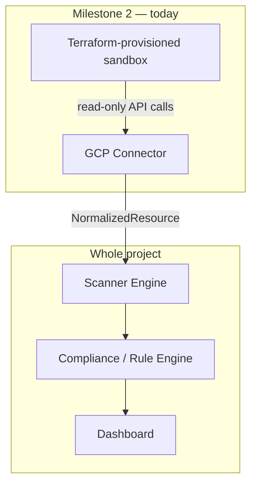
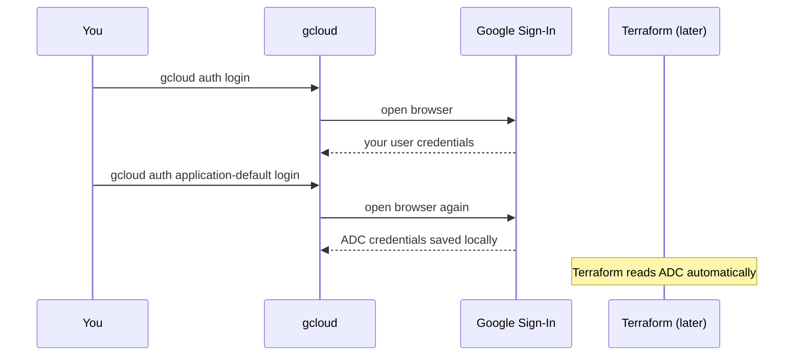

# 🛰️ Milestone 2: The Complete Guide
### From Zero to a Working GCP Connector — Copilot GRC Multi-Cloud

> Welcome, cloud engineer-in-training. This is not documentation — it's a course. Read it top to bottom, do the
> mini-challenges, and by the end you won't just have working code, you'll understand *why every single piece of
> it exists.*

---

## 📊 Progress tracker (I'll remind you where we are throughout)

```
✅ You are here: Before the implementation
⬜ Concepts mastered
⬜ Environment set up from zero
⬜ Terraform infrastructure live
⬜ Authentication working
⬜ Scanner implementation (4 collectors)
⬜ Testing
⬜ Documentation & final validation
```

---

## 📚 Table of contents

1. [Before the implementation](#1--before-the-implementation)
2. [Concepts, explained from zero](#2--concepts-explained-from-zero)
3. [Environment setup from absolute zero](#3--environment-setup-from-absolute-zero)
4. [Project structure](#4--project-structure)
5. [Implementation, file by file](#5--implementation-file-by-file)
6. [Testing](#6--testing)
7. [Final validation](#7--final-validation)
8. [Bonus: best practices, troubleshooting, FAQ](#8--bonus-best-practices-troubleshooting-faq)

---

## 1. 🎯 Before the implementation

### What is Milestone 2 trying to accomplish?

Turn one of your three cloud providers — Google Cloud — from "an account that exists" into "a source of real,
structured, trustworthy data your project can reason about." Concretely: read-only code that connects to a live
GCP project and returns its IAM bindings, Storage buckets, Firewall rules, and Audit Log settings, each one
translated into the exact shape (`NormalizedResource`) you built and tested in Milestone 1.

### Why does this milestone exist?

Milestone 1 was a *promise*: "here's the shape every connector's output will have." A promise nobody has tested
against a real, messy, unpredictable API is just a hope. Milestone 2 is where that promise either holds up or
reveals a gap — while it's still cheap to fix.

### How it fits inside the overall architecture

```
          Dashboard
               │
        Compliance Engine
               │
        Scanner Engine
               │
      Cloud Providers
       ├── AWS   (Student A)
       ├── Azure (shared, Milestone 3)
       └── GCP   (you, right now)
```

Zooming into exactly where Milestone 2 lives:



### What will you build by the end?

1. A GCP sandbox project that exists **because Terraform said so**, not because you clicked through a console.
2. A dedicated, least-privilege credential your code authenticates with.
3. Four Python functions, each reading one GCP service and returning `NormalizedResource` objects.
4. A test suite proving all of it works — without needing a live connection every time.

### How does this prepare the following milestones?

| Later milestone | What it needs from Milestone 2 |
|---|---|
| Milestone 3 — Rule engine | A real list of `NormalizedResource` objects to evaluate rules against |
| Milestone 5 — Finding linker | Real, GCP-flavored findings to attach citations to |
| Milestone 7 — Dashboard | Something real to display, instead of mock data |

### Skills you'll gain

- Infrastructure as Code with Terraform
- GCP's identity model (IAM, service accounts, least privilege)
- Working with two different Python SDK styles for the same cloud provider
- Handling pagination correctly (a subtle bug class that's easy to miss until it silently costs you data)
- Testing cloud-dependent code without needing live credentials in every test run

### ✅ Mini challenge before continuing
Without scrolling back up, try to redraw the "Whole project" diagram from memory on paper. Where does your work
today plug in? If you can point to exactly one arrow, you've got it.

---

## 2. 📖 Concepts, explained from zero

> Read every one of these before touching a terminal. I promise none of this is filler — every concept here
> directly explains a decision you'll make today.

### What is GCP?

- **What it is:** Google Cloud Platform — Google's cloud computing service, renting compute, storage, and
  networking over the internet.
- **Why it exists:** so you don't need to own physical servers to run software.
- **When it's used:** any time an application needs infrastructure it doesn't want to buy and maintain itself.
- **Where in our project:** it's your solo-owned cloud, alongside Student A's AWS and your shared Azure work.
- **Analogy:** renting an apartment instead of buying and maintaining a house — you get what you need, when you
  need it, without owning the building.
- **Common mistake:** treating "the cloud" as one universal thing — GCP, AWS, and Azure each have their own
  resource models, which is exactly why Milestone 1's normalization layer exists.

### What is a Cloud Project?

- **What it is:** GCP's basic container for resources — every bucket, service account, and firewall rule belongs
  to exactly one Project.
- **Why it exists:** to cleanly separate "this stuff" from "that stuff," even within the same Google account.
- **Where in our project:** your sandbox is one Project, `copilot-grc-sandbox-fatii`.
- **Analogy:** a labeled storage unit — everything inside is yours, cleanly separated from every other unit in the
  building.
- **Common mistake:** confusing a Project with an Organization (see next).

### What is an Organization?

- **What it is:** an optional container that groups multiple Projects, usually tied to a company's Google
  Workspace domain.
- **Why it exists:** so companies with many teams and many Projects can apply policy across all of them at once.
- **Where in our project:** you almost certainly don't have one as a student — and that's completely fine, Projects
  work independently without one.

### What is a Service Account?

- **What it is:** an identity meant for *code* to use, distinct from your personal human login.
- **Why it exists:** you don't want your code authenticating as *you* — if that credential leaks, it has all of
  your personal access, with no clean way to tell "was this a human action or a script?"
- **Where in our project:** `grc-scanner`, the identity your Python connector authenticates as.
- **Analogy:** a robot employee with its own narrow-access badge — never the building owner's master key handed to
  a robot "just this once."

### What is IAM?

- **What it is:** Identity and Access Management — the system answering "who can do what, to which resource."
- **Why it exists:** without access control, any identity with a login could do anything.
- **Where in our project:** both something you *configure* (granting your service account read-only access) and
  something your connector will later *read* (to find risky permission grants — Milestone 3's job).

### What are IAM Roles?

- **What they are:** named bundles of permissions (e.g., `roles/viewer` = read almost everything, nothing more)
  granted to an identity.
- **Why they matter here:** your service account gets exactly one role — `roles/viewer` — nothing broader.

### Why should we avoid Owner permissions?

- **What "Owner" means:** total, unrestricted control over a Project — create, modify, delete anything, including
  billing and IAM itself.
- **Why avoid it for a scanner:** the entire point of a compliance-scanning tool is to *observe*, never modify.
  Granting Owner (or even Editor) to a scanning credential is itself the exact kind of over-privileged access this
  tool is built to detect in *other* systems — a glaring, avoidable irony.

### What are APIs in GCP, and why must they be enabled?

- **What it is:** every GCP service (Storage, Compute, IAM...) is exposed as a set of API endpoints your code (or
  the console) calls.
- **Why they must be enabled first:** APIs are off by default per Project — a safety and cost-control measure, so
  a new Project doesn't silently expose every possible service on day one.
- **Where in our project:** `google_project_service` resources in Terraform turn on exactly the 4 (soon 5) your
  connector needs.

### What is Cloud Resource Manager?

- **What it is:** the GCP API for managing Projects themselves and their IAM policies at the Project level.
- **Where in our project:** your IAM and Audit Log collectors both call this API (`cloudresourcemanager.googleapis.com`).

### What is Cloud Asset Inventory?

- **What it is:** a GCP service that maintains a historical, searchable inventory of *all* resources in a Project
  or Organization — a more powerful alternative to calling each service's API individually.
- **Why we're not using it today:** it's a genuinely useful tool for a larger-scale future version of this project,
  but for 4 specific resource types, calling each service's own API directly is simpler to understand and teach —
  a deliberate scoping choice, not an oversight.

### What is the Google Cloud CLI (`gcloud`)?

- **What it is:** the command-line tool for interacting with GCP — creating resources, managing IAM, and
  authenticating your terminal.
- **Where in our project:** you'll use it to sign in and to bridge your identity to Terraform.

### What is ADC (Application Default Credentials)?

- **What it is:** a standard way for Google's client libraries to automatically find valid credentials without you
  hardcoding a key path in every script.
- **Where in our project:** `gcloud auth application-default login` sets this up locally so Terraform's Google
  provider (and later, quick verification scripts) can authenticate automatically.

### What are OAuth credentials?

- **What they are:** a standard protocol for granting an application limited access to your account without
  sharing your actual password.
- **Where in our project:** this is what happens behind the scenes during `gcloud auth login`'s browser sign-in.

### What is JSON authentication (a service account key)?

- **What it is:** a downloadable JSON file containing a service account's private credentials.
- **Why it's different from OAuth:** it doesn't expire the way a user session does, and it represents an
  application identity, not a human one — exactly what your always-running connector needs.
- **Where in our project:** `gcp-scanner-key.json`, generated by Terraform, referenced by
  `GOOGLE_APPLICATION_CREDENTIALS`.

### What is Billing, and what is the Free Tier?

- **Billing account:** a payment profile linked to your Projects — required to exist, even if nothing ever charges
  it.
- **Free Trial:** a one-time $300 credit for new accounts, valid 90 days — a safety cushion, not something this
  project needs to rely on.
- **Always Free:** a *separate*, permanent tier of specific services with a monthly free quota that never expires
  and never requires the trial credit — this is what our sandbox actually runs on.

### What services are Always Free (relevant to us)?

- A small amount of Cloud Storage, a generous number of Compute Engine `e2-micro` hours (not used this milestone),
  and API calls to Resource Manager/Compute/Logging for reading configuration (essentially free at our scale —
  we're doing lightweight `list`/`get` calls, not heavy compute).

### What can accidentally generate costs?

- Leaving large Compute Engine VMs running (we're not creating any).
- Storing large amounts of data in Cloud Storage (our sandbox stays empty or near-empty).
- Very high API call volumes (irrelevant at student-project scale).

### Best practices to never exceed the Free Tier

- Only create resources through Terraform, so you always know exactly what exists.
- Run `terraform plan` before `apply` — review before creating anything.
- Run `terraform destroy` when you're done experimenting for the day, if you want zero footprint (optional for an
  Always Free sandbox, but good habit-building for real-world cost discipline).
- Set a budget alert in the GCP Console (Billing → Budgets & alerts) as a safety net — takes 2 minutes, costs
  nothing, and emails you if anything unexpected starts accruing.

### ✅ Mini quiz
1. What's the difference between a service account and your personal Google login?
2. Why does the scanner get `roles/viewer` instead of `roles/editor`?
3. What's the difference between the Free Trial and Always Free?

<details><summary>Answers</summary>
1. A service account is an identity for code/automation; your personal login represents you as a human, with
broader access you don't want your code to inherit.
2. Least privilege — a scanning tool should only ever be able to read, never modify.
3. Free Trial is a one-time, time-limited $300 credit; Always Free is a permanent, ongoing free quota for specific
services that never expires.
</details>

---

## 3. 🚀 Environment setup from absolute zero

### Step 1 — Create a Google account (skip if you already have one)

Go to [accounts.google.com/signup](https://accounts.google.com/signup). **Why:** every GCP action is tied to a
Google identity — this is the foundation everything else builds on.

### Step 2 — Create a GCP Free Tier account

1. Go to [cloud.google.com/free](https://cloud.google.com/free) and click **Get started for free**.
2. Sign in with your Google account.
3. You'll be asked for a **credit card** — this is required by Google to prevent abuse of free resources, but you
   will not be automatically charged; GCP requires you to manually upgrade before any paid usage is possible.
4. You'll be enrolled in the **Free Trial** (90 days, $300 credit) automatically — separate from, and in addition
   to, the **Always Free** tier this project actually relies on.

> 📸 *[Screenshot placeholder: the "Start free" signup page, showing the Free Trial terms before payment info]*

**How billing works here, concretely:** even after your Free Trial ends, most of what this project touches
(reading IAM policies, listing a handful of empty storage buckets, checking firewall rules) falls under Always
Free limits indefinitely.

### Step 3 — Create a Project

Via the console: click the project dropdown at the top → **New Project**.

- **Naming:** a human-readable name (`Copilot GRC Sandbox`) — can be changed later, purely cosmetic.
- **Project ID:** must be **globally unique across all of GCP**, lowercase, no spaces — this is what your code and
  Terraform will actually reference (`copilot-grc-sandbox-fatii`). **Cannot be changed after creation.**
- **Region:** we're not deploying regional compute resources this milestone, so this matters less here — Terraform
  sets a default (`us-central1`) at the provider level.
- **Labels:** optional key-value tags for organizing/filtering resources later — not needed for a single sandbox
  project.

> 💡 We'll actually create this Project through **Terraform**, not the console, in Section 5 —
> console-based creation is shown here for conceptual understanding only.

### Step 4 — Install Google Cloud CLI

**What it is / why we need it:** the bridge between your terminal, your Google identity, and Terraform.

**Download:** [cloud.google.com/sdk/docs/install](https://cloud.google.com/sdk/docs/install) — run the Windows
installer.

**Verify PATH registration** — close and reopen PowerShell first (required):
```powershell
gcloud --version
```
**Expected output:** version numbers for `Google Cloud SDK`, `bq`, `core`, `gcloud-crc32c`.
**Common error:** `'gcloud' is not recognized` → you're still in the old terminal window from before install; open
a genuinely new one.

### Step 5 — Authenticate



```powershell
gcloud auth login
```
- **Purpose:** signs `gcloud` in as *you*, the human operator — used for provisioning-level actions.
- **Expected output:** a browser window opens; after sign-in, the terminal prints `You are now logged in as
  [your-email].`
- **Common error:** browser doesn't open automatically → `gcloud` prints a URL to copy-paste manually instead;
  works identically.

```powershell
gcloud auth application-default login
```
- **Purpose:** creates the local Application Default Credentials file — this is specifically what **Terraform's**
  Google provider reads to authenticate, separately from your general `gcloud` login.
- **Why we need both:** `auth login` is for `gcloud` commands you type yourself; `application-default login` is
  for *tools* (like Terraform) that need to authenticate programmatically on your behalf.
- **Expected output:** a second browser window, ending in `Credentials saved to file: [...]`.

```powershell
gcloud config set project copilot-grc-sandbox-fatii
```
- **Purpose:** sets your default active Project for future `gcloud` commands — so you don't have to specify
  `--project` on every single one.
- **What it changes:** a local config file — nothing on the cloud side.

**Verify everything:**
```powershell
gcloud auth list
gcloud config get-value project
```
**Expected:** your email listed as the active account; your project ID printed back.

### ✅ Progress check

```
✅ Environment ready (Git, Python, gcloud, Terraform all installed)
✅ Authentication (both user and ADC logins complete)
⬜ Scanner implementation
⬜ Testing
⬜ Documentation
```

---

## 4. 🗂️ Project structure

```
GRC-PROJECT/
├── infra/
│   └── gcp/
│       ├── providers.tf       ← "we're talking to Google Cloud"
│       ├── variables.tf        ← configurable inputs (billing account, project ID)
│       ├── main.tf             ← the actual resources to create
│       ├── outputs.tf          ← how to retrieve the generated key
│       ├── terraform.tfvars    ← your personal values (never committed)
│       └── .gitignore          ← excludes state files and secrets
├── scanner/
│   ├── schema.py                ← Milestone 1's contract
│   └── collectors/
│       ├── __init__.py
│       └── gcp.py               ← today's connector
├── tests/
│   └── collectors/
│       ├── __init__.py
│       └── test_gcp.py          ← mocked proof it works
├── .env                          ← local credentials path (never committed)
└── requirements.txt
```

| Folder | Purpose |
|---|---|
| `infra/gcp/` | Infrastructure as Code — what exists in the real cloud, described as text |
| `scanner/collectors/` | Cloud-specific code — nothing outside this folder should know GCP-specific field names |
| `tests/collectors/` | Automated, mocked proof each connector behaves correctly |

---

## 5. 🛠️ Implementation, file by file

### Progress check
```
✅ Environment ready
✅ Authentication
🔶 Scanner implementation — starting now
⬜ Testing
⬜ Documentation
```

### File 1 — `infra/gcp/.gitignore`

**Why we need it, and why first:** so a secret can never accidentally be committed, even for one commit.

```powershell
New-Item -ItemType Directory -Force -Path "infra\gcp"
cd infra\gcp
@"
*.tfvars
.terraform/
*.tfstate
*.tfstate.backup
*.json
"@ | Out-File -FilePath ".gitignore" -Encoding utf8
```

### File 2 — `infra/gcp/providers.tf`

**Why:** declares which cloud Terraform is provisioning for. **Where it belongs:** `infra/gcp/`.

```hcl
terraform {
  required_providers {
    google = {
      source  = "hashicorp/google"
      version = "~> 5.0"
    }
  }
}

provider "google" {
  region = "us-central1"
}
```
**Line-by-line:** the `required_providers` block tells Terraform which plugin to download; `provider "google"`
configures it with a default region.

### File 3 — `infra/gcp/variables.tf`

```hcl
variable "billing_account_id" {
  description = "Your GCP billing account ID"
  type        = string
}

variable "project_id" {
  description = "Globally unique GCP project ID for the sandbox"
  type        = string
  default     = "copilot-grc-sandbox-fatii"
}
```
**Why separate variables from hardcoded values:** your billing account ID is personal — it shouldn't be baked
into a file every reader (including a future public repo visitor) sees.

### File 4 — `infra/gcp/main.tf`

```hcl
resource "google_project" "sandbox" {
  name            = "Copilot GRC Sandbox"
  project_id      = var.project_id
  billing_account = var.billing_account_id
}

resource "google_project_service" "apis" {
  for_each = toset([
    "storage.googleapis.com",
    "compute.googleapis.com",
    "cloudresourcemanager.googleapis.com",
    "logging.googleapis.com",
    "iam.googleapis.com",
  ])
  project = google_project.sandbox.project_id
  service = each.value
}

resource "google_service_account" "scanner" {
  project      = google_project.sandbox.project_id
  account_id   = "grc-scanner"
  display_name = "GRC Scanner (read-only)"
  depends_on   = [google_project_service.apis]
}

resource "google_project_iam_member" "scanner_viewer" {
  project = google_project.sandbox.project_id
  role    = "roles/viewer"
  member  = "serviceAccount:${google_service_account.scanner.email}"
}

resource "google_service_account_key" "scanner_key" {
  service_account_id = google_service_account.scanner.name
}
```
**Line-by-line, the concepts made real:**
- `google_project` — this **is** Step 3's manual console flow, as code.
- `google_project_service` with `for_each` — one block enabling 5 APIs, instead of 5 near-identical blocks.
- `google_service_account` — the Service Account concept from Section 2, made real. `depends_on` guarantees the
  IAM API is enabled before the identity is created.
- `google_project_iam_member` with `role = "roles/viewer"` — the exact least-privilege decision from "Why avoid
  Owner permissions?"
- `google_service_account_key` — generates the JSON authentication file.

### File 5 — `infra/gcp/outputs.tf`

```hcl
output "scanner_key_json" {
  value     = base64decode(google_service_account_key.scanner_key.private_key)
  sensitive = true
}
```
**Why `sensitive = true`:** prevents Terraform from printing the key in plain text during normal operations.

### File 6 — `infra/gcp/terraform.tfvars` (never committed)

```powershell
gcloud billing accounts list
```
Copy the `ACCOUNT_ID`, then:
```powershell
@"
billing_account_id = "PASTE-YOUR-ACCOUNT-ID-HERE"
"@ | Out-File -FilePath "terraform.tfvars" -Encoding utf8
```

**Test this whole batch of files:**
```powershell
terraform init
terraform plan
```
**Expected:** `Plan: 6 to add, 0 to change, 0 to destroy.`
```powershell
terraform apply
```
Type `yes`. **Expected:** `Apply complete! Resources: 6 added, 0 changed, 0 destroyed.`
```powershell
terraform output -raw scanner_key_json > gcp-scanner-key.json
```
**Common mistake:** running `terraform apply` without reading the plan first — always review what's about to be
created.

### Progress check
```
✅ Environment ready
✅ Authentication
✅ Infrastructure live (Terraform)
🔶 Scanner code — starting now
⬜ Testing
```

### File 7 — `.env` (project root, never committed)

```powershell
cd ..\..
@"
GCP_PROJECT_ID=copilot-grc-sandbox-fatii
GOOGLE_APPLICATION_CREDENTIALS=./infra/gcp/gcp-scanner-key.json
"@ | Out-File -FilePath ".env" -Encoding utf8
```

### File 8 — Python dependencies

```powershell
.venv\Scripts\Activate.ps1
pip install pydantic pyyaml pytest typing_extensions google-cloud-storage google-api-python-client google-auth python-dotenv
pip freeze > requirements.txt
```

**Test authentication end to end:**
```powershell
python -c "
import os
from dotenv import load_dotenv
load_dotenv()
from google.cloud import storage
project_id = os.environ['GCP_PROJECT_ID']
storage.Client(project=project_id)
print('Fully connected. Project:', project_id)
"
```
**Expected:** `Fully connected. Project: copilot-grc-sandbox-fatii`

### File 9 — `scanner/collectors/gcp.py`

**Why this file, and why it interacts with nothing but `schema.py`:** it's the only place in the whole project
that should ever know GCP-specific field names — everything downstream only understands `NormalizedResource`.

```python
"""GCP connector — reads IAM bindings, Storage, Firewall rules, and Audit
Log configuration, normalizing everything into scanner.schema.NormalizedResource."""
import google.auth
from google.cloud import storage
from googleapiclient.discovery import build

from scanner.schema import NormalizedResource

PUBLIC_MEMBERS = {"allUsers", "allAuthenticatedUsers"}


def _resourcemanager_client():
    credentials, _ = google.auth.default()
    return build("cloudresourcemanager", "v1", credentials=credentials)


def collect_iam_bindings(project_id: str) -> list[NormalizedResource]:
    service = _resourcemanager_client()
    policy = service.projects().getIamPolicy(resource=project_id, body={}).execute()
    resources = []
    for binding in policy.get("bindings", []):
        is_public = any(m in PUBLIC_MEMBERS for m in binding.get("members", []))
        resources.append(
            NormalizedResource(
                cloud_provider="gcp",
                resource_type="iam_binding",
                resource_id=f"{project_id}:{binding['role']}",
                tags={},
                attributes={"is_public": is_public},
                raw_data={"role": binding["role"], "members": binding.get("members", [])},
            )
        )
    return resources


def collect_storage_findings(project_id: str) -> list[NormalizedResource]:
    client = storage.Client(project=project_id)
    resources = []
    for bucket in client.list_buckets():
        policy = bucket.get_iam_policy(requested_policy_version=3)
        is_public = any(
            m in PUBLIC_MEMBERS for b in policy.bindings for m in b.get("members", [])
        )
        resources.append(
            NormalizedResource(
                cloud_provider="gcp",
                resource_type="storage_bucket",
                resource_id=bucket.name,
                region=bucket.location,
                tags={},
                attributes={
                    "is_public": is_public,
                    "encrypted_with_customer_key": bucket.default_kms_key_name is not None,
                    "versioning_enabled": bool(bucket.versioning_enabled),
                },
                raw_data={"name": bucket.name},
            )
        )
    return resources


def collect_firewall_findings(project_id: str) -> list[NormalizedResource]:
    credentials, _ = google.auth.default()
    service = build("compute", "v1", credentials=credentials)
    resources = []
    request = service.firewalls().list(project=project_id)
    while request is not None:
        response = request.execute()
        for rule in response.get("items", []):
            open_to_world = "0.0.0.0/0" in rule.get("sourceRanges", [])
            resources.append(
                NormalizedResource(
                    cloud_provider="gcp",
                    resource_type="firewall_rule",
                    resource_id=rule["name"],
                    tags={},
                    attributes={"open_to_world": open_to_world, "direction": rule.get("direction", "")},
                    raw_data={"name": rule["name"], "allowed": rule.get("allowed", [])},
                )
            )
        request = service.firewalls().list_next(previous_request=request, previous_response=response)
    return resources


def collect_audit_log_findings(project_id: str) -> list[NormalizedResource]:
    service = _resourcemanager_client()
    policy = service.projects().getIamPolicy(resource=project_id, body={}).execute()
    audit_configs = policy.get("auditConfigs", [])
    return [
        NormalizedResource(
            cloud_provider="gcp",
            resource_type="audit_config",
            resource_id=project_id,
            tags={},
            attributes={"data_access_logging_enabled": len(audit_configs) > 0},
            raw_data={"audit_configs": audit_configs},
        )
    ]
```

**Test it against your real sandbox:**
```powershell
python -c "
from dotenv import load_dotenv
load_dotenv()
import os
from scanner.collectors.gcp import collect_iam_bindings, collect_storage_findings, collect_firewall_findings, collect_audit_log_findings
pid = os.environ['GCP_PROJECT_ID']
all_r = collect_iam_bindings(pid) + collect_storage_findings(pid) + collect_firewall_findings(pid) + collect_audit_log_findings(pid)
print(f'Collected {len(all_r)} resources')
for r in all_r: print(' -', r.resource_type, r.resource_id)
"
```
**Expected output:** a handful of resources — likely 2 default firewall rules (`default-allow-internal`,
`default-allow-ssh`), several IAM bindings, and 1 audit config, 0 buckets on a fresh project.

**Common mistakes here specifically:**
- Forgetting the `while` loop on firewall rules → silently misses data on a larger project.
- Putting a judgment (like `is_public`) only in `raw_data` instead of a clean `attributes` field → Milestone 3
  would have to re-parse nested JSON instead of checking one clean boolean.

### File 10 — `scanner/run_gcp_scan.py`

```python
from scanner.collectors.gcp import (
    collect_audit_log_findings,
    collect_firewall_findings,
    collect_iam_bindings,
    collect_storage_findings,
)
from scanner.schema import NormalizedResource


def run_gcp_scan(project_id: str) -> list[NormalizedResource]:
    resources: list[NormalizedResource] = []
    resources += collect_iam_bindings(project_id)
    resources += collect_storage_findings(project_id)
    resources += collect_firewall_findings(project_id)
    resources += collect_audit_log_findings(project_id)
    return resources


if __name__ == "__main__":
    import os
    from dotenv import load_dotenv

    load_dotenv()
    results = run_gcp_scan(os.environ["GCP_PROJECT_ID"])
    print(f"Collected {len(results)} normalized resources.")
```

---

## 6. 🧪 Testing

### Progress check
```
✅ Environment ready
✅ Authentication
✅ Infrastructure live
✅ Scanner implementation
🔶 Testing — now
⬜ Documentation
```

`tests/collectors/test_gcp.py`:
```python
from unittest.mock import MagicMock, patch

from scanner.collectors.gcp import collect_iam_bindings, collect_storage_findings


@patch("scanner.collectors.gcp._resourcemanager_client")
def test_iam_binding_flags_public_member(mock_make_client):
    fake_service = MagicMock()
    fake_service.projects().getIamPolicy().execute.return_value = {
        "bindings": [{"role": "roles/viewer", "members": ["allUsers"]}]
    }
    mock_make_client.return_value = fake_service
    results = collect_iam_bindings("fake-project")
    assert results[0].attributes["is_public"] is True


@patch("scanner.collectors.gcp.storage.Client")
def test_storage_collector_flags_public_bucket(mock_storage_client_cls):
    fake_bucket = MagicMock()
    fake_bucket.name = "my-bucket"
    fake_bucket.location = "US"
    fake_bucket.default_kms_key_name = None
    fake_bucket.versioning_enabled = False
    fake_bucket.get_iam_policy.return_value.bindings = [{"members": ["allUsers"]}]
    fake_client = MagicMock()
    fake_client.list_buckets.return_value = [fake_bucket]
    mock_storage_client_cls.return_value = fake_client
    results = collect_storage_findings("fake-project")
    assert results[0].attributes["is_public"] is True
```

```powershell
python -m pytest tests\collectors\test_gcp.py -v
```
**Expected output:** `2 passed`.

**Why mocks, not live calls, for the committed test suite:** tests need to be fast, free, deterministic, and
runnable without live credentials — none of which is true of a real API call every time.

**Debugging a failed test:**
1. Read the full pytest error — it names the exact assertion that failed.
2. Check you patched the right target: `scanner.collectors.gcp.storage.Client` (where it's *used*), not
   `google.cloud.storage.Client` (where it's *defined*) — the single most common mocking mistake.

---

## 7. ✅ Final validation

```powershell
terraform -chdir=infra\gcp plan
python -m pytest tests\collectors\test_gcp.py -v
python scanner\run_gcp_scan.py
```

**All three must succeed:**
- `No changes. Your infrastructure matches the configuration.`
- `2 passed`
- `Collected N normalized resources.`

### Final checklist

- [ ] ✅ GCP account created
- [ ] ✅ Billing enabled
- [ ] ✅ Cloud CLI installed
- [ ] ✅ Authentication working (both `auth login` and `application-default login`)
- [ ] ✅ Terraform provisions the sandbox reproducibly
- [ ] ✅ Scanner connects to GCP
- [ ] ✅ Resources collected (all 4 types)
- [ ] ✅ Data normalized into `NormalizedResource`
- [ ] ✅ Tests pass
- [ ] ✅ No secrets committed (`.tfvars`, `.tfstate`, key JSON, `.env` all `.gitignore`d)
- [ ] ✅ Documentation completed (this file, committed to `docs/`)

### Progress tracker, final state

```
✅ Environment ready
✅ Authentication
✅ Infrastructure live
✅ Scanner implementation
✅ Testing
✅ Documentation
```

---

## 8. 🎁 Bonus: best practices, troubleshooting, FAQ

### GCP best practices
- Provision through Terraform, always — never hand-click a resource you can't reproduce.
- Enable only the APIs you actually use.
- Tag/label resources if a project grows past a single sandbox.

### Security best practices
- Least privilege on every credential — `roles/viewer`, never broader.
- Rotate a service account key if it's ever suspected of leaking (`gcloud iam service-accounts keys delete`).
- Never commit `.env`, `.tfvars`, `.tfstate`, or any `*.json` key file.

### IAM least privilege, restated
If you're ever unsure which role to grant, ask "what's the smallest role that still does the job?" — for a
read-only scanner, that's `roles/viewer`, full stop.

### Free Tier limitations to keep in mind
- Always Free quotas are generous but not infinite — for a single-student sandbox with light API usage, you will
  not come close to them.
- The $300 Free Trial credit is a 90-day cushion, not something this specific project relies on.

### Project organization tips
- Mirror your task IDs (`B1`, etc.) in folder/file names where practical — makes cross-referencing your report
  trivial later.

### Troubleshooting guide

| Symptom | Likely cause | Fix |
|---|---|---|
| `DefaultCredentialsError` | `.env` not loaded or wrong path | Confirm `load_dotenv()` runs before any GCP client is created |
| `403 Forbidden` | API not enabled, or IAM binding not yet applied | Re-run `terraform apply`, confirm 6 resources exist |
| `ModuleNotFoundError: No module named 'scanner'` | Running Python from the wrong folder | Run from the project root |
| Mocked test hits the real network | Wrong patch target | Patch where the function is *used*, not where it's defined |
| `terraform apply` fails with a billing error | Billing account not linked or not open | Recheck `gcloud billing accounts list` shows `OPEN: True` |

### Frequently asked questions

**Q: Do I need to run `terraform destroy` when I'm done for the day?**
A: Not required for an Always Free sandbox at this scale, but it's good practice to build the habit for real-world
cost discipline.

**Q: Can I reuse this exact Terraform pattern for Azure?**
A: The *shape* of the pattern (provider block, resources, least-privilege IAM, generated credentials) transfers
directly — the specific resource types will differ, and that's exactly the kind of thing worth pairing with
Student A on.

**Q: What if `project_id` is already taken?**
A: Project IDs are globally unique across all of GCP — add a suffix (`copilot-grc-sandbox-fatii-2026`) and update
`variables.tf`'s default.

### Tips from experienced cloud engineers
- "If you can't explain what a credential can do, you've already over-provisioned it."
- "Terraform plan is your seatbelt — reading it before every apply is not optional caution, it's the job."
- "Mock everything that costs money or requires network access in your test suite — your future CI pipeline will
  thank you."

---

🎉 **Milestone 2, fully documented and complete.** You went from no GCP account at all to a reproducible,
least-privilege, tested connector producing real data. That's not a tutorial exercise — that's the actual second
slice of a real product. See you at Milestone 3.
