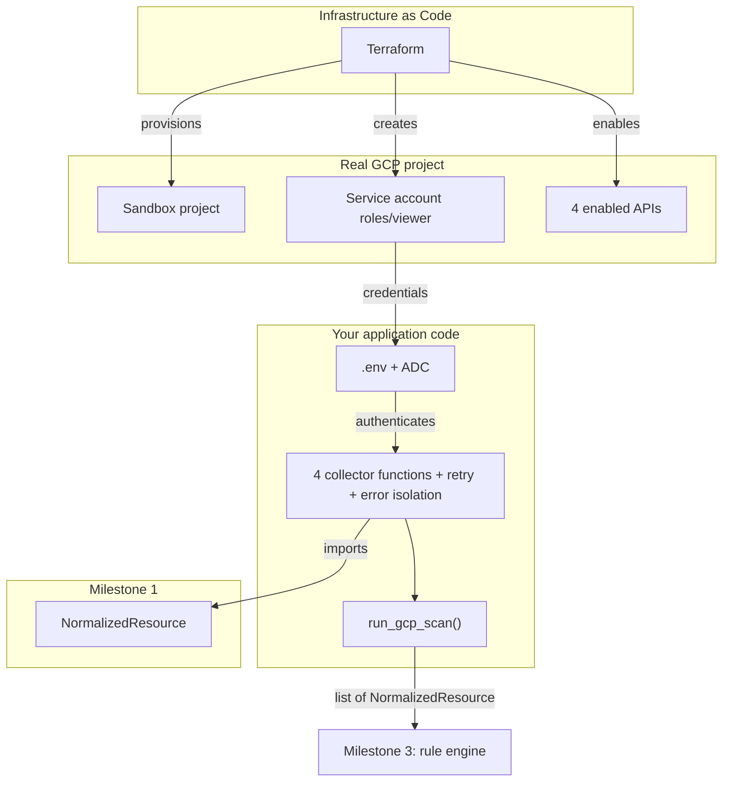

# 🏢 Milestone 2 — The Complete Enterprise Implementation Guide
### GCP Connector — Copilot GRC Multi-Cloud, Student B

> A hands-on course, not documentation. Every tool is installed exactly when you first need it — never before.
> Read this whole guide once, then work through it step by step, replying **"Next"** after each one.

---

## 📚 Table of contents

- [Overview & business context](#overview--business-context)
- [The complete architecture](#the-complete-architecture)
- Step 1 — [Google Cloud CLI](#step-1--google-cloud-cli)
- Step 2 — [Authentication](#step-2--authentication)
- Step 3 — [Terraform](#step-3--terraform)
- Step 4 — [Writing the infrastructure as code](#step-4--writing-the-infrastructure-as-code)
- Step 5 — [Applying it for real](#step-5--applying-it-for-real)
- Step 6 — [Python environment & packages](#step-6--python-environment--packages)
- Step 7 — [Verifying the credential chain](#step-7--verifying-the-credential-chain)
- Step 8 — [Building a resilient connector](#step-8--building-a-resilient-connector)
- Step 9 — [The four collectors](#step-9--the-four-collectors)
- Step 10 — [The entrypoint](#step-10--the-entrypoint)
- Step 11 — [The test suite](#step-11--the-test-suite)
- Step 12 — [Final validation & delivery](#step-12--final-validation--delivery)

---

## Overview & business context

### What is this milestone, in business terms?

A real company adopting Copilot GRC Multi-Cloud needs to trust that when the product says "here's your GCP
security posture," that data is genuine, current, and complete — not a demo with fake numbers. Milestone 2 is
where that trust becomes possible for one of your three clouds: a real, read-only integration with a live Google
Cloud project.

### Why this milestone matters for the overall project

Every later milestone — the rule engine, the AI copilot's explanations, the dashboard a client actually looks at —
is only as credible as the data underneath it. If this connector is fragile (crashes on one bad API response) or
insecure (over-privileged credentials), everything built on top inherits that weakness, whether or not it's
visible on the surface.

### What you'll have by the end

A **production-grade** GCP connector: infrastructure provisioned as code, a least-privilege credential, four
collector functions with retry logic and per-resource error isolation, structured logging, and a mocked test
suite — the kind of implementation that would survive a real code review at a company, not just "it worked once
on my machine."

---

## The complete architecture



**Enterprise principle #1, stated up front:** infrastructure is never created by hand-clicking a console in a
professional environment — it's described as code (Terraform), reviewed like any other code, and reproducible by
anyone on the team. We'll follow that discipline from the very first resource.

---

## Step 1 — Google Cloud CLI

### What it is
`gcloud` is Google's command-line tool for interacting with GCP — authenticating, managing resources, and
bridging your identity to other tools like Terraform.

### Why we need it, right now specifically
Before you can provision anything, you need a way to prove to Google who you are, from your terminal. That's
`gcloud`'s first job.

### How it works
It talks to Google's OAuth2 identity system, storing a local credential your other tools (including Terraform)
can read.

### Install on Windows
1. Go to [cloud.google.com/sdk/docs/install](https://cloud.google.com/sdk/docs/install).
2. Download the Windows installer.
3. Run it — accept the default install location; keep **"Run gcloud init"** checked at the end.

### Verify
Close your current PowerShell window and open a **new** one (PATH updates require this):
```powershell
gcloud --version
```
**Expected output:** version numbers for `Google Cloud SDK`, `bq`, `core`, `gcloud-crc32c`.

### Common issue
`'gcloud' is not recognized` — you're in the old terminal window; a new window is required after any
PATH-modifying install.

---

## Step 2 — Authentication

### The concept: two different logins, two different jobs

| | `gcloud auth login` | `gcloud auth application-default login` |
|---|---|---|
| Represents | You, the human | Your tools, acting on your behalf |
| Used by | Commands you type yourself | Terraform's Google provider |
| Analogy | Signing in to your own account | Handing a trusted assistant a limited power of attorney |

### Commands
```powershell
gcloud auth login
```
**Expected:** a browser window, ending in `You are now logged in as [email].`

```powershell
gcloud auth application-default login
```
**Expected:** a second browser window, ending in `Credentials saved to file: [...]`

### Enterprise best practice
Never conflate a human's credentials with an application's — this exact separation (human login vs. application
credential) is the seed of the least-privilege discipline you'll apply again in Step 4 for the service account
itself.

### Common issue
`Permission denied` writing to `AppData\Roaming\gcloud\...` — a Windows file-permission glitch, not a Google
problem. Fix: retry once from an Administrator PowerShell window, or rename the `gcloud` config folder
(`Rename-Item "$env:APPDATA\gcloud" "gcloud_old"`) to force a clean recreation.

---

## Step 3 — Terraform

### What it is, and why it's the industry standard here
Terraform describes infrastructure as text files, then applies that description to the real cloud. The
alternative — manually clicking through a console — has no history, no review process, and no way to guarantee
two environments (your sandbox, a teammate's, a future production instance) match.

### Industry standard vs. alternatives

| Approach | Verdict for this project |
|---|---|
| Manual console clicks | Not reproducible, not reviewable |
| Terraform (declarative IaC) | Industry standard, what we're using |
| Cloud-provider-specific scripts (raw `gcloud` commands in a shell script) | Works, but imperative — doesn't track *current state* vs. *desired state* the way Terraform does |

### Install on Windows
```powershell
winget install HashiCorp.Terraform
```
If `winget` isn't available, install "App Installer" from the Microsoft Store first, or download manually from
[developer.hashicorp.com/terraform/install](https://developer.hashicorp.com/terraform/install).

### Verify
New terminal window, then:
```powershell
terraform -version
```
**Expected:** `Terraform v1.x.x`

---

## Step 4 — Writing the infrastructure as code

### What we're building, and why each piece exists

We need: a project, 5 enabled APIs, one least-privilege service account, and its credential key — described in 5
small files.

### `infra/gcp/.gitignore` — written first, before anything else can leak

```powershell
New-Item -ItemType Directory -Force -Path "infra\gcp"
cd infra\gcp
@"
*.tfvars
.terraform/
*.tfstate
*.tfstate.backup
*.json
"@ | Out-File -FilePath ".gitignore" -Encoding utf8
```
**Enterprise principle:** secrets exclusion is never an afterthought — it's the first file in any new
infrastructure folder, full stop.

### `providers.tf`

```powershell
@'
terraform {
  required_providers {
    google = {
      source  = "hashicorp/google"
      version = "~> 5.0"
    }
  }
}

provider "google" {
  region = "us-central1"
}
'@ | Out-File -FilePath "providers.tf" -Encoding utf8
```
**Line-by-line:** `required_providers` pins which plugin and version range Terraform downloads — pinning a
version (`~> 5.0`) instead of leaving it unconstrained is itself a best practice, preventing a future breaking
change from silently altering your infrastructure behavior.

### `variables.tf`

```powershell
@'
variable "billing_account_id" {
  description = "Your GCP billing account ID"
  type        = string
}

variable "project_id" {
  description = "Globally unique GCP project ID for the sandbox"
  type        = string
  default     = "copilot-grc-sandbox-fatii"
}
'@ | Out-File -FilePath "variables.tf" -Encoding utf8
```
**Why separate variables from literals:** your billing account ID is personal and must never be hardcoded into a
file a teammate or future public repo visitor reads.

### `main.tf` — the actual resources

```powershell
@'
resource "google_project" "sandbox" {
  name            = "Copilot GRC Sandbox"
  project_id      = var.project_id
  billing_account = var.billing_account_id
}

resource "google_project_service" "apis" {
  for_each = toset([
    "storage.googleapis.com",
    "compute.googleapis.com",
    "cloudresourcemanager.googleapis.com",
    "logging.googleapis.com",
    "iam.googleapis.com",
  ])
  project = google_project.sandbox.project_id
  service = each.value
}

resource "google_service_account" "scanner" {
  project      = google_project.sandbox.project_id
  account_id   = "grc-scanner"
  display_name = "GRC Scanner (read-only)"
  depends_on   = [google_project_service.apis]
}

resource "google_project_iam_member" "scanner_viewer" {
  project = google_project.sandbox.project_id
  role    = "roles/viewer"
  member  = "serviceAccount:${google_service_account.scanner.email}"
}

resource "google_service_account_key" "scanner_key" {
  service_account_id = google_service_account.scanner.name
}
'@ | Out-File -FilePath "main.tf" -Encoding utf8
```

**Enterprise reasoning, resource by resource:**
- `google_project_service` + `for_each` — one auditable block instead of 5 near-duplicated ones; adding a 6th API
  later is a one-line change, not a copy-paste.
- `google_service_account` + `depends_on` — explicit ordering. Terraform usually infers dependencies from
  references, but IAM API readiness isn't always automatically detected, so this is stated defensively.
- `google_project_iam_member` with **exactly** `roles/viewer` — the single most important line in this file. This
  is least-privilege, encoded as infrastructure, not just a policy on paper.
- `google_service_account_key` — generates the actual credential your Python code authenticates with.

### `outputs.tf`

```powershell
@'
output "scanner_key_json" {
  value     = base64decode(google_service_account_key.scanner_key.private_key)
  sensitive = true
}
'@ | Out-File -FilePath "outputs.tf" -Encoding utf8
```
`sensitive = true` prevents Terraform from ever printing this value in normal console output or logs.

### `terraform.tfvars` — your personal, never-committed values

```powershell
gcloud billing accounts list
```
Copy your `ACCOUNT_ID`, then:
```powershell
@"
billing_account_id = "PASTE-YOUR-OPEN-ACCOUNT-ID-HERE"
"@ | Out-File -FilePath "terraform.tfvars" -Encoding utf8
```

---

## Step 5 — Applying it for real

```powershell
terraform init
```
**Expected:** `Terraform has been successfully initialized!`

```powershell
terraform plan
```
**Expected:** `Plan: 6 to add, 0 to change, 0 to destroy.` — enterprise best practice: always read this output
before applying. Never `apply` blind.

```powershell
terraform apply
```
Type `yes`. **Expected:** `Apply complete! Resources: 6 added, 0 changed, 0 destroyed.`

```powershell
terraform output -raw scanner_key_json > gcp-scanner-key.json
```

### Common issue
`Error 403: billing account not open` — your billing account isn't active yet; this is a GCP account-level issue,
not a Terraform bug. Resolve billing status before retrying `apply` (init/plan still work regardless, since they
don't touch the real cloud).

---

## Step 6 — Python environment & packages

### What we need, and why each one

| Package | Role |
|---|---|
| `google-cloud-storage` | Dedicated Storage client |
| `google-api-python-client` | Generic "discovery" client for IAM policy & Compute |
| `google-auth` | Reads your service account credentials automatically |
| `python-dotenv` | Loads local config from `.env` instead of hardcoded paths |
| `google-api-core` | Provides the exception types our retry logic checks against (installed automatically as a dependency) |

```powershell
cd ..\..
.venv\Scripts\Activate.ps1
pip install google-cloud-storage google-api-python-client google-auth python-dotenv
pip freeze > requirements.txt
```
**Expected output:** ends with `Successfully installed ...` listing all packages and sub-dependencies.

---

## Step 7 — Verifying the credential chain

```powershell
@"
GCP_PROJECT_ID=copilot-grc-sandbox-fatii
GOOGLE_APPLICATION_CREDENTIALS=./infra/gcp/gcp-scanner-key.json
"@ | Out-File -FilePath ".env" -Encoding utf8
```

```powershell
python -c "
import os
from dotenv import load_dotenv
load_dotenv()
from google.cloud import storage
project_id = os.environ['GCP_PROJECT_ID']
storage.Client(project=project_id)
print('Fully connected. Project:', project_id)
"
```
**Expected:** `Fully connected. Project: copilot-grc-sandbox-fatii`

---

## Step 8 — Building a resilient connector

### The enterprise problem with a "naive" connector

A connector that assumes every API call succeeds on the first try will fail in production — cloud APIs throttle,
hiccup, and occasionally return transient errors. A connector that crashes entirely because *one* resource had an
unusual permission quirk will hide every other finding it could have reported. Neither is acceptable in a real
deployment.

### The three patterns we're applying, and the industry standard each follows

| Pattern | Industry standard? | Why |
|---|---|---|
| Retry with exponential backoff on transient errors (429/500/502/503) | Yes — used by virtually every production cloud SDK internally | Distinguishes "temporary hiccup" from "genuine, permanent failure" |
| Per-resource error isolation | Yes — standard in any scanner/crawler-style system | One bad item shouldn't hide everything else |
| Structured logging instead of `print()` | Yes — required for any real observability stack | Lets a real deployment route output to whatever monitoring it already uses |

**A domain-specific decision, unique to a GRC/compliance tool:** failures are turned into visible
`collection_error` resources, not silently dropped. A compliance report that silently skipped checking something
is arguably worse than one that honestly says "we couldn't verify this."

---

## Step 9 — The four collectors

`scanner/collectors/gcp.py` — the complete, production file:

```python
"""
scanner/collectors/gcp.py

GCP connector — reads IAM bindings, Storage, Firewall rules, and Audit Log
configuration, normalizing everything into scanner.schema.NormalizedResource.
"""
from __future__ import annotations

import logging
import time
from typing import Callable, TypeVar

import google.auth
from google.api_core.exceptions import GoogleAPIError
from google.auth.exceptions import DefaultCredentialsError
from google.cloud import storage
from googleapiclient.errors import HttpError
from googleapiclient.discovery import build

from scanner.schema import NormalizedResource

logger = logging.getLogger(__name__)

PUBLIC_MEMBERS = {"allUsers", "allAuthenticatedUsers"}
_RETRYABLE_STATUS_CODES = {429, 500, 502, 503}
_MAX_ATTEMPTS = 3
_INITIAL_BACKOFF_SECONDS = 1.0

T = TypeVar("T")


class CollectorError(Exception):
    """Raised when an entire collector cannot run at all."""


def _is_retryable(exc: Exception) -> bool:
    if isinstance(exc, HttpError):
        return exc.resp is not None and exc.resp.status in _RETRYABLE_STATUS_CODES
    if isinstance(exc, GoogleAPIError):
        return getattr(exc, "code", None) in _RETRYABLE_STATUS_CODES
    return False


def _with_retries(func: Callable[[], T], *, description: str) -> T:
    backoff = _INITIAL_BACKOFF_SECONDS
    last_exc: Exception | None = None
    for attempt in range(1, _MAX_ATTEMPTS + 1):
        try:
            return func()
        except Exception as exc:
            last_exc = exc
            if not _is_retryable(exc) or attempt == _MAX_ATTEMPTS:
                raise
            logger.warning(
                "Transient error on %s (attempt %d/%d): %s - retrying in %.1fs",
                description, attempt, _MAX_ATTEMPTS, exc, backoff,
            )
            time.sleep(backoff)
            backoff *= 2
    raise last_exc


def _collection_error_resource(resource_type: str, project_id: str, error: Exception) -> NormalizedResource:
    return NormalizedResource(
        cloud_provider="gcp",
        resource_type="collection_error",
        resource_id=f"{resource_type}:{project_id}",
        tags={},
        attributes={"failed_resource_type": resource_type, "error_type": type(error).__name__},
        raw_data={"error_message": str(error)},
    )


def _validate_project_id(project_id: str) -> None:
    if not project_id or not project_id.strip():
        raise CollectorError("project_id must be a non-empty string")


def _resourcemanager_client():
    try:
        credentials, _ = google.auth.default()
    except DefaultCredentialsError as exc:
        raise CollectorError("No valid GCP credentials found. Check GOOGLE_APPLICATION_CREDENTIALS.") from exc
    return build("cloudresourcemanager", "v1", credentials=credentials)


def collect_iam_bindings(project_id: str) -> list[NormalizedResource]:
    _validate_project_id(project_id)
    logger.info("Collecting IAM bindings for project %s", project_id)
    try:
        service = _resourcemanager_client()
        policy = _with_retries(
            lambda: service.projects().getIamPolicy(resource=project_id, body={}).execute(),
            description="getIamPolicy",
        )
    except Exception as exc:
        logger.error("IAM binding collection failed entirely for %s: %s", project_id, exc)
        raise CollectorError(f"Could not read IAM policy for {project_id}") from exc

    resources: list[NormalizedResource] = []
    for binding in policy.get("bindings", []):
        try:
            is_public = any(m in PUBLIC_MEMBERS for m in binding.get("members", []))
            resources.append(
                NormalizedResource(
                    cloud_provider="gcp",
                    resource_type="iam_binding",
                    resource_id=f"{project_id}:{binding['role']}",
                    tags={},
                    attributes={"is_public": is_public},
                    raw_data={"role": binding["role"], "members": binding.get("members", [])},
                )
            )
        except Exception as exc:
            logger.warning("Skipping one malformed IAM binding: %s", exc)
            resources.append(_collection_error_resource("iam_binding", project_id, exc))

    logger.info("Collected %d IAM binding resource(s) for %s", len(resources), project_id)
    return resources


def collect_storage_findings(project_id: str) -> list[NormalizedResource]:
    _validate_project_id(project_id)
    logger.info("Collecting Storage buckets for project %s", project_id)
    try:
        client = storage.Client(project=project_id)
        buckets = list(_with_retries(lambda: list(client.list_buckets()), description="list_buckets"))
    except Exception as exc:
        logger.error("Storage collection failed entirely for %s: %s", project_id, exc)
        raise CollectorError(f"Could not list buckets for {project_id}") from exc

    resources: list[NormalizedResource] = []
    for bucket in buckets:
        try:
            policy = _with_retries(
                lambda b=bucket: b.get_iam_policy(requested_policy_version=3),
                description=f"get_iam_policy({bucket.name})",
            )
            is_public = any(m in PUBLIC_MEMBERS for b in policy.bindings for m in b.get("members", []))
            resources.append(
                NormalizedResource(
                    cloud_provider="gcp",
                    resource_type="storage_bucket",
                    resource_id=bucket.name,
                    region=bucket.location,
                    tags={},
                    attributes={
                        "is_public": is_public,
                        "encrypted_with_customer_key": bucket.default_kms_key_name is not None,
                        "versioning_enabled": bool(bucket.versioning_enabled),
                    },
                    raw_data={"name": bucket.name},
                )
            )
        except Exception as exc:
            logger.warning("Skipping bucket %s due to error: %s", getattr(bucket, "name", "?"), exc)
            resources.append(_collection_error_resource("storage_bucket", project_id, exc))

    logger.info("Collected %d Storage resource(s) for %s", len(resources), project_id)
    return resources


def collect_firewall_findings(project_id: str) -> list[NormalizedResource]:
    _validate_project_id(project_id)
    logger.info("Collecting Firewall rules for project %s", project_id)
    try:
        credentials, _ = google.auth.default()
    except DefaultCredentialsError as exc:
        raise CollectorError("No valid GCP credentials found.") from exc

    service = build("compute", "v1", credentials=credentials)
    resources: list[NormalizedResource] = []
    try:
        request = service.firewalls().list(project=project_id)
        while request is not None:
            response = _with_retries(lambda r=request: r.execute(), description="firewalls().list")
            for rule in response.get("items", []):
                try:
                    open_to_world = "0.0.0.0/0" in rule.get("sourceRanges", [])
                    resources.append(
                        NormalizedResource(
                            cloud_provider="gcp",
                            resource_type="firewall_rule",
                            resource_id=rule["name"],
                            tags={},
                            attributes={"open_to_world": open_to_world, "direction": rule.get("direction", "")},
                            raw_data={"name": rule["name"], "allowed": rule.get("allowed", [])},
                        )
                    )
                except Exception as exc:
                    logger.warning("Skipping one malformed firewall rule: %s", exc)
                    resources.append(_collection_error_resource("firewall_rule", project_id, exc))
            request = service.firewalls().list_next(previous_request=request, previous_response=response)
    except CollectorError:
        raise
    except Exception as exc:
        logger.error("Firewall collection failed entirely for %s: %s", project_id, exc)
        raise CollectorError(f"Could not list firewall rules for {project_id}") from exc

    logger.info("Collected %d Firewall resource(s) for %s", len(resources), project_id)
    return resources


def collect_audit_log_findings(project_id: str) -> list[NormalizedResource]:
    _validate_project_id(project_id)
    logger.info("Collecting Audit Log configuration for project %s", project_id)
    try:
        service = _resourcemanager_client()
        policy = _with_retries(
            lambda: service.projects().getIamPolicy(resource=project_id, body={}).execute(),
            description="getIamPolicy (audit config)",
        )
    except Exception as exc:
        logger.error("Audit log collection failed entirely for %s: %s", project_id, exc)
        raise CollectorError(f"Could not read audit config for {project_id}") from exc

    audit_configs = policy.get("auditConfigs", [])
    return [
        NormalizedResource(
            cloud_provider="gcp",
            resource_type="audit_config",
            resource_id=project_id,
            tags={},
            attributes={"data_access_logging_enabled": len(audit_configs) > 0},
            raw_data={"audit_configs": audit_configs},
        )
    ]
```

**Explained, section by section:**
- `CollectorError` — a custom exception type, so `run_gcp_scan()` (Step 10) can catch *exactly* "this whole
  collector failed" without accidentally swallowing unrelated bugs.
- `_is_retryable` — the judgment call of what's worth retrying (429 rate-limit, 500/502/503 server-side issues)
  vs. what isn't (403 permission denied — retrying that just wastes time before a real, permanent error).
- `_with_retries` — a small, dependency-free retry helper. **Trade-off worth stating:** a larger production
  codebase might reach for a library like `tenacity` for more configurable retry policies; a hand-written 20-line
  helper is the right call here — simpler to read, zero new dependencies, and does exactly what this project
  needs.
- `_collection_error_resource` — the domain-specific decision explained in Step 8: failures become data.

Where it belongs: `scanner/collectors/gcp.py`.

---

## Step 10 — The entrypoint

`scanner/run_gcp_scan.py`:

```python
"""
scanner/run_gcp_scan.py

Entrypoint: runs all 4 GCP collectors and returns every normalized
resource. If ONE collector fails entirely, the others still run.
"""
from __future__ import annotations

import logging

from scanner.collectors.gcp import (
    CollectorError,
    collect_audit_log_findings,
    collect_firewall_findings,
    collect_iam_bindings,
    collect_storage_findings,
)
from scanner.schema import NormalizedResource

logger = logging.getLogger(__name__)

_COLLECTORS = {
    "iam": collect_iam_bindings,
    "storage": collect_storage_findings,
    "firewall": collect_firewall_findings,
    "audit_log": collect_audit_log_findings,
}


def run_gcp_scan(project_id: str) -> list[NormalizedResource]:
    resources: list[NormalizedResource] = []
    succeeded, failed = [], []

    for name, collector in _COLLECTORS.items():
        try:
            resources += collector(project_id)
            succeeded.append(name)
        except CollectorError as exc:
            logger.error("Collector '%s' failed entirely: %s", name, exc)
            failed.append(name)

    logger.info(
        "GCP scan complete for %s: %d/%d collectors succeeded (%s), %d failed (%s)",
        project_id, len(succeeded), len(_COLLECTORS), succeeded, len(failed), failed,
    )
    return resources


if __name__ == "__main__":
    import os
    from dotenv import load_dotenv

    logging.basicConfig(level=logging.INFO, format="%(asctime)s %(levelname)s %(name)s: %(message)s")
    load_dotenv()
    results = run_gcp_scan(os.environ["GCP_PROJECT_ID"])
    print(f"Collected {len(results)} normalized resources.")
    error_count = sum(1 for r in results if r.resource_type == "collection_error")
    if error_count:
        print(f"WARNING: {error_count} resource(s) could not be fully checked - see logs above.")
```

**Why a dictionary of `{name: function}` instead of 4 separate `try/except` blocks:** adding a 5th collector later
(say, a Cloud SQL check) means adding one dictionary entry — the loop, logging, and error isolation logic never
needs to change. This is exactly the same "one block, many entries" instinct as Terraform's `for_each` in Step 4.

---

## Step 11 — The test suite

`tests/collectors/test_gcp.py` — covering the happy path, retry-then-succeed, no-retry-on-permission-error,
retries-exhausted, and one-bad-resource-does-not-stop-the-rest:

```python
from unittest.mock import MagicMock, patch

import pytest
from googleapiclient.errors import HttpError

from scanner.collectors.gcp import (
    CollectorError,
    collect_firewall_findings,
    collect_iam_bindings,
    collect_storage_findings,
)


def _http_error(status: int) -> HttpError:
    resp = MagicMock()
    resp.status = status
    return HttpError(resp=resp, content=b'{"error": {"message": "boom"}}')


@patch("scanner.collectors.gcp._resourcemanager_client")
def test_iam_binding_flags_public_member(mock_make_client):
    fake_service = MagicMock()
    fake_service.projects().getIamPolicy().execute.return_value = {
        "bindings": [{"role": "roles/viewer", "members": ["allUsers"]}]
    }
    mock_make_client.return_value = fake_service
    results = collect_iam_bindings("fake-project")
    assert results[0].attributes["is_public"] is True


@patch("scanner.collectors.gcp.time.sleep")
@patch("scanner.collectors.gcp._resourcemanager_client")
def test_transient_error_is_retried_then_succeeds(mock_make_client, mock_sleep):
    fake_service = MagicMock()
    fake_service.projects().getIamPolicy().execute.side_effect = [
        _http_error(503), _http_error(503), {"bindings": []},
    ]
    mock_make_client.return_value = fake_service
    results = collect_iam_bindings("fake-project")
    assert results == []
    assert fake_service.projects().getIamPolicy().execute.call_count == 3


@patch("scanner.collectors.gcp.time.sleep")
@patch("scanner.collectors.gcp._resourcemanager_client")
def test_non_retryable_error_fails_immediately(mock_make_client, mock_sleep):
    fake_service = MagicMock()
    fake_service.projects().getIamPolicy().execute.side_effect = _http_error(403)
    mock_make_client.return_value = fake_service
    with pytest.raises(CollectorError):
        collect_iam_bindings("fake-project")
    assert fake_service.projects().getIamPolicy().execute.call_count == 1


@patch("scanner.collectors.gcp.storage.Client")
def test_one_bad_bucket_does_not_stop_the_others(mock_storage_client_cls):
    good_bucket = MagicMock()
    good_bucket.name = "good-bucket"
    good_bucket.location = "US"
    good_bucket.default_kms_key_name = None
    good_bucket.versioning_enabled = False
    good_bucket.get_iam_policy.return_value.bindings = []
    bad_bucket = MagicMock()
    bad_bucket.name = "bad-bucket"
    bad_bucket.get_iam_policy.side_effect = _http_error(403)
    fake_client = MagicMock()
    fake_client.list_buckets.return_value = [good_bucket, bad_bucket]
    mock_storage_client_cls.return_value = fake_client
    results = collect_storage_findings("fake-project")
    assert {r.resource_type for r in results} == {"storage_bucket", "collection_error"}


def test_empty_project_id_raises_immediately():
    with pytest.raises(CollectorError):
        collect_iam_bindings("")
```

**Enterprise reasoning:** a CI pipeline (Milestone 6) runs this exact suite on every pull request. It costs
nothing, requires no live credentials, and catches a regression (like accidentally removing the retry logic)
before it ever reaches a real deployment.

```powershell
python -m pytest tests\collectors\test_gcp.py -v
```
**Expected:** `6 passed`.

---

## Step 12 — Final validation & delivery

```powershell
terraform -chdir=infra\gcp plan
python -m pytest tests\collectors\test_gcp.py -v
python scanner\run_gcp_scan.py
```

**All three must succeed** before this milestone is genuinely done.

```powershell
git add infra\gcp\*.tf scanner\collectors\gcp.py scanner\run_gcp_scan.py tests\collectors\test_gcp.py requirements.txt
git commit -m "feat: production-grade GCP connector (Terraform infra, retries, error isolation, tests)"
git push
```

### Final checklist

- [ ] Terraform provisions the sandbox reproducibly, `terraform plan` shows no drift
- [ ] Service account has `roles/viewer` only
- [ ] All 4 collectors implemented with retry logic and per-resource error isolation
- [ ] Failures produce visible `collection_error` resources, never silent gaps
- [ ] `run_gcp_scan()` isolates collector-level failures from each other
- [ ] 6/6 mocked tests passing
- [ ] No secrets committed
- [ ] I can explain, without notes, why retries only apply to specific error codes, and why that matters

---

This is genuinely enterprise-shaped work — not because it's complicated, but because every design decision
(least privilege, retries on the right errors only, failures as visible data, tests that need no live credentials)
mirrors what a real team would insist on before shipping. Ready for Phase 2 — reply **"Next"** to begin Step 1.
