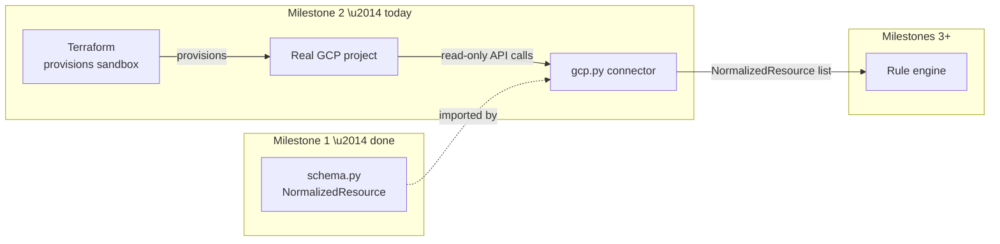
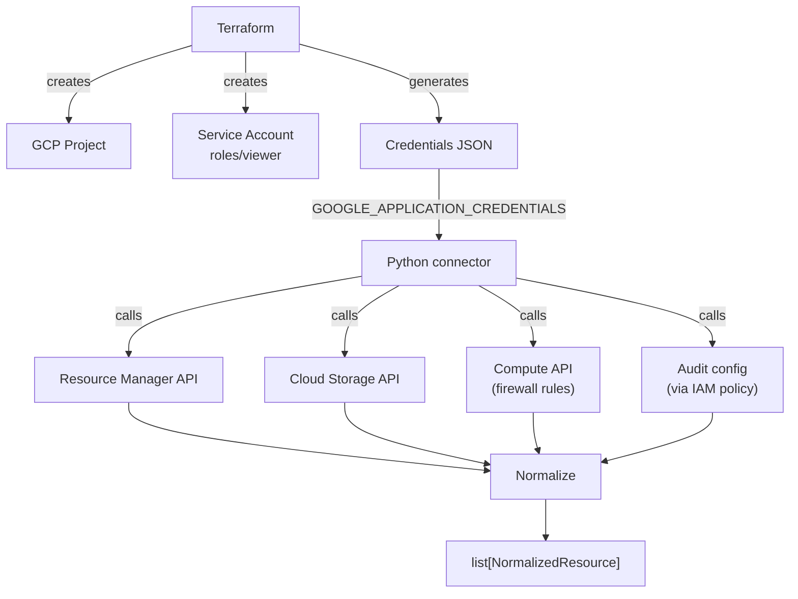
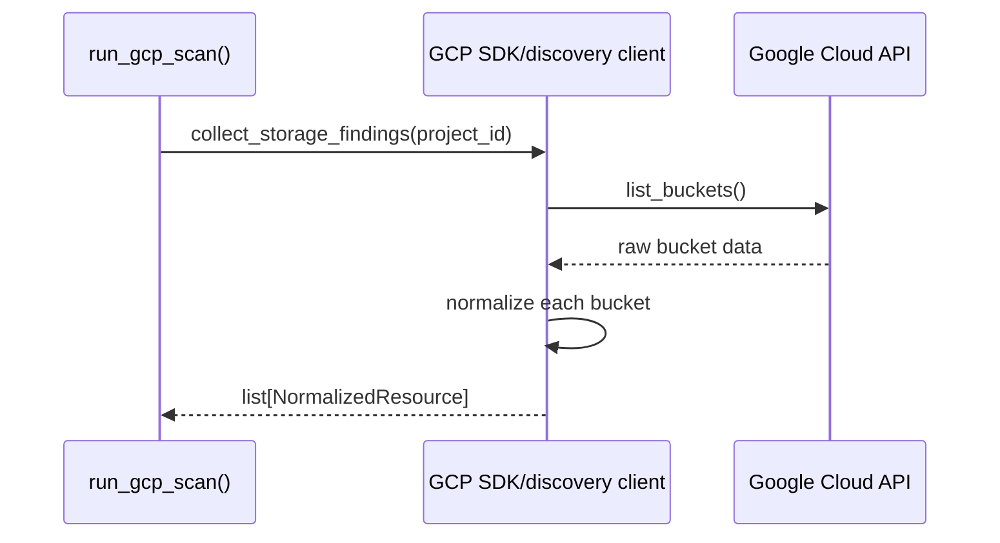

# 🛰️ Milestone 2 — The GCP Connector
### Copilot GRC Multi-Cloud — Student B's Complete Guide

> Companion to your Milestone 1 guides. This one takes you from zero Terraform/GCP knowledge to a tested, working,
> read-only connector producing real `NormalizedResource` objects from a live Google Cloud project.

---

## 📚 Table of contents

1. [Milestone 2 overview](#1--milestone-2-overview)
2. [Prerequisites](#2--prerequisites)
3. [Understanding the architecture](#3--understanding-the-architecture)
4. [File structure](#4--file-structure)
5. [Step-by-step implementation](#5--step-by-step-implementation)
6. [Testing](#6--testing)
7. [Practical exercises](#7--practical-exercises)
8. [Mini challenges](#8--mini-challenges)
9. [Knowledge check](#9--knowledge-check)
10. [Best practices](#10--best-practices)
11. [Real-world perspective](#11--real-world-perspective)
12. [Final project validation](#12--final-project-validation)
13. [Readiness checklist](#13--readiness-checklist)

---

## 1. 🎯 Milestone 2 overview

### What is the goal?

Build `scanner/collectors/gcp.py`: real, read-only code that connects to a live Google Cloud project and returns
its IAM bindings, Storage buckets, Firewall rules, and Audit Log configuration — each one converted into a
`NormalizedResource`, the exact frozen Pydantic model you tested 20 ways in Milestone 1.

Alongside it, you'll provision the sandbox itself with **Terraform** — not clicked together by hand, but described
as code, the same discipline a real infrastructure team uses.

### Why is this milestone important?

Milestone 1 was a promise: "here's the shape every connector's output will have." Milestone 2 is the first time
that promise gets tested against something real and messy — an actual cloud API, with pagination, permissions,
and edge cases a hand-written test can't fully simulate.

### How does it build on Milestone 1?

Every single function you write today ends with the same line: constructing a `NormalizedResource`. If Milestone
1's contract were shaky, this is exactly where it would break.

### How it fits into the overall architecture



### What new components are introduced?

| Component | What it does | Problem it solves |
|---|---|---|
| Terraform config (`infra/gcp/*.tf`) | Provisions the sandbox project, APIs, and service account as code | Reproducibility \u2014 no "what did I click again?" |
| GCP service account | A dedicated, read-only credential for your code | Least privilege \u2014 your connector never uses your personal login |
| 4 collector functions | Read IAM, Storage, Firewall, and Audit Log data | Turns raw GCP API responses into your project's common shape |
| `run_gcp_scan()` | Runs all 4 collectors and returns one combined list | A single entrypoint the rule engine (Milestone 3) will call |

### ✅ Checkpoint
- [ ] I can explain, in one sentence, why Terraform provisions the sandbox instead of the GCP Console.
- [ ] I can name the 4 GCP services this milestone reads from.

---

## 2. 📖 Prerequisites

### 2.1 Infrastructure as Code (IaC) & Terraform

- **Simply put:** describing infrastructure ("I want this project, these APIs, this service account") in text
  files, then having a tool apply that description to the real cloud.
- **Real-world analogy:** a blueprint vs. a house built from memory. Two contractors given the same blueprint
  build the same house; two contractors "winging it" build two different houses.
- **Why needed here:** if your sandbox ever needs to be rebuilt, or Student A needs an equivalent Azure setup, "run
  `terraform apply`" beats "try to remember every click."
- **Where it appears:** `infra/gcp/main.tf`, `variables.tf`, `providers.tf`.
- **Key vocabulary:** `provider` (which cloud Terraform talks to), `resource` (one thing to create),
  `variable` (a configurable input), `state` (Terraform's record of what it already created).

### 2.2 The GCP resource hierarchy

```
Organization (rare for students)
  └── Project              ← everything lives inside one
        └── Resources        ← buckets, service accounts, firewall rules...
```
- **Analogy:** a Project is a labeled storage unit — everything inside is cleanly separated from every other unit.

### 2.3 IAM, service accounts, and least privilege

- **IAM:** the system answering "who can do what, to which resource."
- **Service account:** an identity meant for code, not a human, to use.
- **Least privilege:** grant the smallest role that gets the job done — here, `roles/viewer` (read-only).
- **Why it matters so much this milestone:** you're about to generate a real, downloadable credential file. If it
  ever leaks, the blast radius should be "someone can look," never "someone can change or delete."

### 2.4 The two GCP Python SDK patterns

- **Dedicated client libraries** (e.g. `google-cloud-storage`) — polished, hand-crafted, one per service.
- **Generic discovery client** (`googleapiclient.discovery.build(...)`) — one flexible client that talks to *any*
  GCP API by name and version, used for services without (or before) a dedicated library.
- **Why both appear in your connector:** Storage has a polished dedicated library; IAM policy and Firewall rules
  are commonly accessed through the generic discovery client. Both are legitimate, official Google tooling.

### 2.5 Pagination

- **Simply put:** when an API has too many results for one response, it returns a "page" plus a token to fetch the
  next one.
- **Why it matters:** skipping this silently misses data — your firewall collector could report only the first 20
  rules on a project that has 50.
- **Analogy:** reading a long document one screen at a time, using "next page" instead of assuming everything fit
  on screen one.

### 2.6 Mocking (from Milestone 1, applied to live APIs now)

- **Recap:** `unittest.mock.patch` replaces a real function with a fake, controllable one during a test.
- **Why it matters more here:** your connector *cannot* be tested in CI with live GCP credentials — mocking is the
  only way to prove your normalization logic works without a real cloud call every time.

### ✅ Checkpoint
- [ ] I can explain why `roles/viewer` is the correct role, not `roles/editor`.
- [ ] I can explain the difference between a dedicated client library and the discovery client.

---

## 3. 🏛️ Understanding the architecture

### Component interactions



### Request/data flow for one collector call



### How Milestone 1 and Milestone 2 interact

Every collector function's *only* contact with Milestone 1 is a single import:
```python
from scanner.schema import NormalizedResource
```
Nothing in `gcp.py` should ever reach into `schema.py` and change it — if a field is missing, that's a
conversation with Student A (per the change policy in `schema.py`'s own docstring), not a quiet edit.

### ✅ Checkpoint
- [ ] I can trace, from memory, what happens between calling `run_gcp_scan()` and getting a result back.

---

## 4. 🗂️ File structure

```
GRC-PROJECT/
├── infra/
│   └── gcp/
│       ├── providers.tf
│       ├── variables.tf
│       ├── main.tf
│       ├── outputs.tf
│       ├── terraform.tfvars      (not committed)
│       └── .gitignore
├── scanner/
│   ├── schema.py                  (Milestone 1)
│   └── collectors/
│       ├── __init__.py
│       └── gcp.py                 ⭐ today
├── tests/
│   └── collectors/
│       ├── __init__.py
│       └── test_gcp.py            ⭐ today
└── .env                            (not committed \u2014 GOOGLE_APPLICATION_CREDENTIALS path)
```

| File | Purpose | Why it exists |
|---|---|---|
| `infra/gcp/*.tf` | Describes the sandbox as code | Reproducible, reviewable infrastructure |
| `scanner/collectors/gcp.py` | The connector itself | Turns GCP API responses into `NormalizedResource` |
| `tests/collectors/test_gcp.py` | Mocked tests | Proves normalization logic works without live credentials |

### ✅ Checkpoint
- [ ] I know exactly which file I'll write code in for each of today's 4 collectors.

---

## 5. 🛠️ Step-by-step implementation

### Step 1 — Terraform: provision the sandbox

*(You already started this — here's the complete picture for reference.)*

**`infra/gcp/providers.tf`:**
```hcl
terraform {
  required_providers {
    google = {
      source  = "hashicorp/google"
      version = "~> 5.0"
    }
  }
}

provider "google" {
  region = "us-central1"
}
```
**What/why:** declares which provider plugin Terraform needs (Google Cloud) and its default region.

**`infra/gcp/variables.tf`:**
```hcl
variable "billing_account_id" {
  description = "Your GCP billing account ID"
  type        = string
}

variable "project_id" {
  description = "Globally unique GCP project ID for the sandbox"
  type        = string
  default     = "copilot-grc-sandbox-fatii"
}
```
**What/why:** inputs Terraform needs but shouldn't hardcode \u2014 your billing account ID is personal, not something
to bake into a file everyone reads.

**`infra/gcp/main.tf`** \u2014 the project, APIs, service account, and its key, all in one place:
```hcl
resource "google_project" "sandbox" {
  name            = "Copilot GRC Sandbox"
  project_id      = var.project_id
  billing_account = var.billing_account_id
}

resource "google_project_service" "apis" {
  for_each = toset([
    "storage.googleapis.com",
    "compute.googleapis.com",
    "cloudresourcemanager.googleapis.com",
    "logging.googleapis.com",
    "iam.googleapis.com",
  ])
  project = google_project.sandbox.project_id
  service = each.value
}

resource "google_service_account" "scanner" {
  project      = google_project.sandbox.project_id
  account_id   = "grc-scanner"
  display_name = "GRC Scanner (read-only)"
  depends_on   = [google_project_service.apis]
}

resource "google_project_iam_member" "scanner_viewer" {
  project = google_project.sandbox.project_id
  role    = "roles/viewer"
  member  = "serviceAccount:${google_service_account.scanner.email}"
}

resource "google_service_account_key" "scanner_key" {
  service_account_id = google_service_account.scanner.name
}
```
**Line-by-line, the new parts:**
- `google_service_account` \u2014 creates the identity itself.
- `google_project_iam_member` with `role = "roles/viewer"` \u2014 this **is** the least-privilege decision from 2.3,
  written as code instead of a manual console click.
- `google_service_account_key` \u2014 generates a real credentials key tied to that service account.

**`infra/gcp/outputs.tf`** \u2014 so you can retrieve the key without hunting through Terraform's internal state:
```hcl
output "scanner_key_json" {
  value     = base64decode(google_service_account_key.scanner_key.private_key)
  sensitive = true
}
```

Apply it:
```powershell
terraform apply
```
**Expected output:** a confirmation prompt showing the plan again, type `yes`, then `Apply complete! Resources: 6 added.`

**Save the key to a real file:**
```powershell
terraform output -raw scanner_key_json > gcp-scanner-key.json
```
> \u26a0\ufe0f Confirm `*.json` key files are covered by a `.gitignore` \u2014 add `gcp-scanner-key.json` explicitly if
> your existing `.gitignore` doesn't already catch it.

### Step 2 — Verify authentication from Python

Create `.env` (not committed):
```
GCP_PROJECT_ID=copilot-grc-sandbox-fatii
GOOGLE_APPLICATION_CREDENTIALS=./infra/gcp/gcp-scanner-key.json
```

```powershell
pip install google-cloud-storage google-api-python-client google-auth python-dotenv
```

`scanner/verify_gcp_auth.py`:
```python
"""One-off script confirming the service account credentials work."""
import os

import google.auth
from dotenv import load_dotenv
from google.cloud import storage

load_dotenv()
project_id = os.environ["GCP_PROJECT_ID"]
credentials, detected_project = google.auth.default()

print(f"Authenticated. Configured project: {project_id}")
client = storage.Client(project=project_id)
print(f"Found {len(list(client.list_buckets()))} bucket(s) \u2014 0 is fine for a fresh sandbox.")
```

```powershell
python scanner\verify_gcp_auth.py
```
**Expected output:**
```
Authenticated. Configured project: copilot-grc-sandbox-fatii
Found 0 bucket(s) — 0 is fine for a fresh sandbox.
```

### Step 3 — The IAM collector

`scanner/collectors/gcp.py`:
```python
"""GCP connector — reads IAM bindings, Storage, Firewall rules, and Audit
Log configuration, normalizing everything into scanner.schema.NormalizedResource."""
import google.auth
from google.cloud import storage
from googleapiclient.discovery import build

from scanner.schema import NormalizedResource

PUBLIC_MEMBERS = {"allUsers", "allAuthenticatedUsers"}


def _resourcemanager_client():
    credentials, _ = google.auth.default()
    return build("cloudresourcemanager", "v1", credentials=credentials)


def collect_iam_bindings(project_id: str) -> list[NormalizedResource]:
    service = _resourcemanager_client()
    policy = service.projects().getIamPolicy(resource=project_id, body={}).execute()

    resources = []
    for binding in policy.get("bindings", []):
        is_public = any(m in PUBLIC_MEMBERS for m in binding.get("members", []))
        resources.append(
            NormalizedResource(
                cloud_provider="gcp",
                resource_type="iam_binding",
                resource_id=f"{project_id}:{binding['role']}",
                tags={},
                attributes={"is_public": is_public},
                raw_data={"role": binding["role"], "members": binding.get("members", [])},
            )
        )
    return resources
```
**Line-by-line, what's new vs. your Milestone 1 tests:** you're now *constructing* `NormalizedResource` from real
data instead of hand-written test fixtures \u2014 notice `attributes` (a small, structured summary the rule engine
will actually check) is kept separate from `raw_data` (the full original response, size-guarded and hidden from
`repr()` per Milestone 1's design).

### Step 4 — The Storage collector

```python
def collect_storage_findings(project_id: str) -> list[NormalizedResource]:
    client = storage.Client(project=project_id)
    resources = []
    for bucket in client.list_buckets():
        policy = bucket.get_iam_policy(requested_policy_version=3)
        is_public = any(
            m in PUBLIC_MEMBERS for b in policy.bindings for m in b.get("members", [])
        )
        resources.append(
            NormalizedResource(
                cloud_provider="gcp",
                resource_type="storage_bucket",
                resource_id=bucket.name,
                region=bucket.location,
                tags={},
                attributes={
                    "is_public": is_public,
                    "encrypted_with_customer_key": bucket.default_kms_key_name is not None,
                    "versioning_enabled": bool(bucket.versioning_enabled),
                },
                raw_data={"name": bucket.name},
            )
        )
    return resources
```

### Step 5 — The Firewall collector (with pagination)

```python
def collect_firewall_findings(project_id: str) -> list[NormalizedResource]:
    credentials, _ = google.auth.default()
    service = build("compute", "v1", credentials=credentials)

    resources = []
    request = service.firewalls().list(project=project_id)
    while request is not None:
        response = request.execute()
        for rule in response.get("items", []):
            open_to_world = "0.0.0.0/0" in rule.get("sourceRanges", [])
            resources.append(
                NormalizedResource(
                    cloud_provider="gcp",
                    resource_type="firewall_rule",
                    resource_id=rule["name"],
                    tags={},
                    attributes={"open_to_world": open_to_world, "direction": rule.get("direction", "")},
                    raw_data={"name": rule["name"], "allowed": rule.get("allowed", [])},
                )
            )
        request = service.firewalls().list_next(previous_request=request, previous_response=response)
    return resources
```
**Why the `while` loop:** this is 2.5's pagination concept made real \u2014 skipping `list_next` would silently miss
rules on any project with more than one page of results.

### Step 6 — The Audit Log collector

```python
def collect_audit_log_findings(project_id: str) -> list[NormalizedResource]:
    service = _resourcemanager_client()
    policy = service.projects().getIamPolicy(resource=project_id, body={}).execute()
    audit_configs = policy.get("auditConfigs", [])

    return [
        NormalizedResource(
            cloud_provider="gcp",
            resource_type="audit_config",
            resource_id=project_id,
            tags={},
            attributes={"data_access_logging_enabled": len(audit_configs) > 0},
            raw_data={"audit_configs": audit_configs},
        )
    ]
```

### Step 7 — The entrypoint

`scanner/run_gcp_scan.py`:
```python
from scanner.collectors.gcp import (
    collect_audit_log_findings,
    collect_firewall_findings,
    collect_iam_bindings,
    collect_storage_findings,
)
from scanner.schema import NormalizedResource


def run_gcp_scan(project_id: str) -> list[NormalizedResource]:
    resources: list[NormalizedResource] = []
    resources += collect_iam_bindings(project_id)
    resources += collect_storage_findings(project_id)
    resources += collect_firewall_findings(project_id)
    resources += collect_audit_log_findings(project_id)
    return resources


if __name__ == "__main__":
    import os
    from dotenv import load_dotenv

    load_dotenv()
    results = run_gcp_scan(os.environ["GCP_PROJECT_ID"])
    print(f"Collected {len(results)} normalized resources.")
```

### ✅ Checkpoint
- [ ] All 4 collectors and the entrypoint exist and run against your real sandbox without error.

---

## 6. 🧪 Testing

### Terraform

```powershell
terraform plan
```
**Expected:** `No changes.` once applied \u2014 proves your `.tf` files and the real cloud state agree.

### Manual smoke test

```powershell
python scanner\run_gcp_scan.py
```
**Expected output:** `Collected N normalized resources.` (N depends on your sandbox \u2014 likely a handful of default
firewall rules + 1 audit config, 0 buckets on a fresh project).

### Automated, mocked tests

`tests/collectors/test_gcp.py`:
```python
from unittest.mock import MagicMock, patch

from scanner.collectors.gcp import collect_iam_bindings, collect_storage_findings


@patch("scanner.collectors.gcp._resourcemanager_client")
def test_iam_binding_flags_public_member(mock_make_client):
    fake_service = MagicMock()
    fake_service.projects().getIamPolicy().execute.return_value = {
        "bindings": [{"role": "roles/viewer", "members": ["allUsers"]}]
    }
    mock_make_client.return_value = fake_service

    results = collect_iam_bindings("fake-project")

    assert len(results) == 1
    assert results[0].attributes["is_public"] is True


@patch("scanner.collectors.gcp.storage.Client")
def test_storage_collector_flags_public_bucket(mock_storage_client_cls):
    fake_bucket = MagicMock()
    fake_bucket.name = "my-bucket"
    fake_bucket.location = "US"
    fake_bucket.default_kms_key_name = None
    fake_bucket.versioning_enabled = False
    fake_bucket.get_iam_policy.return_value.bindings = [{"members": ["allUsers"]}]

    fake_client = MagicMock()
    fake_client.list_buckets.return_value = [fake_bucket]
    mock_storage_client_cls.return_value = fake_client

    results = collect_storage_findings("fake-project")

    assert results[0].attributes["is_public"] is True
```

```powershell
python -m pytest tests\collectors\test_gcp.py -v
```
**Expected output:** `2 passed`.

### Common errors

| Error | Cause | Fix |
|---|---|---|
| `google.auth.exceptions.DefaultCredentialsError` | `.env` not loaded, or wrong path | Confirm `load_dotenv()` runs first, check `GOOGLE_APPLICATION_CREDENTIALS` path |
| `403 Forbidden` | API not enabled, or IAM binding not applied | Re-check `terraform apply` completed with 6 resources added |
| Test tries to hit the real network | Wrong patch target | Patch where the function is *used* (`scanner.collectors.gcp.X`), not where it's defined |

---

## 7. 🏋️ Practical exercises

**Exercise 1:** Add a `region` field to the IAM binding collector's `NormalizedResource` (hint: IAM bindings are
project-wide, not regional \u2014 what should this be?). *Expected: `region=None`, since it's genuinely not
applicable.*

**Exercise 2:** Create one real public test bucket
(`gsutil mb gs://your-test-bucket && gsutil iam ch allUsers:objectViewer gs://your-test-bucket`), re-run
`run_gcp_scan.py`, confirm `is_public: True` appears, then delete the bucket.

---

## 8. 🏆 Mini challenges

**Challenge:** the Compute API's firewall list can also be paginated with a `maxResults` parameter to test
pagination on a small project. Modify `collect_firewall_findings` to accept an optional `page_size` parameter and
pass it to `.list(project=project_id, maxResults=page_size)`.

<details><summary>Solution</summary>

```python
def collect_firewall_findings(project_id: str, page_size: int | None = None) -> list[NormalizedResource]:
    credentials, _ = google.auth.default()
    service = build("compute", "v1", credentials=credentials)
    kwargs = {"project": project_id}
    if page_size:
        kwargs["maxResults"] = page_size
    request = service.firewalls().list(**kwargs)
    # ... rest unchanged
```
</details>

---

## 9. ✅ Knowledge check

**MCQ:** Why does `collect_firewall_findings` use a `while` loop instead of one `.execute()` call?
(A) Style preference (B) To handle pagination (C) Firewalls require retries (D) No reason

<details><summary>Answer</summary>B \u2014 a single call might not return every rule if there are many; `list_next` fetches subsequent pages.</details>

**True/False:** `roles/viewer` allows the scanner to modify firewall rules if it finds a problem.

<details><summary>Answer</summary>False \u2014 Viewer is read-only; the scanner can only report, never fix, by design.</details>

**Scenario:** what happens if `GOOGLE_APPLICATION_CREDENTIALS` points to a file that doesn't exist?

<details><summary>Answer</summary>`google.auth.exceptions.DefaultCredentialsError` \u2014 caught early, at the first API call, not silently ignored.</details>

---

## 10. 🧹 Best practices

- Least privilege, always \u2014 `roles/viewer`, never broader "just in case."
- Never commit `.tfstate`, `.tfvars`, or key files \u2014 all three can contain sensitive project details.
- Keep `attributes` structured and small (what the rule engine needs); keep `raw_data` complete but bounded (what
  the audit trail needs).
- Test with mocks, not live credentials \u2014 your CI pipeline (Milestone 6) will thank you.

## Common beginner mistakes

- Using personal Google credentials "just to get it working" instead of the dedicated service account.
- Forgetting `list_next` and not noticing until a larger project silently loses data.
- Committing `terraform.tfstate` by accident \u2014 always double-check `git status` before every commit.

---

## 11. 🌍 Real-world perspective

- **Infrastructure as Code at scale:** companies like Google, Netflix, and virtually every serious cloud-native
  organization manage production infrastructure through Terraform (or similar tools) specifically because manual
  console changes don't scale past a handful of engineers \u2014 exactly the reproducibility problem you solved today.
- **Least-privilege service accounts:** this is a literal, direct requirement in frameworks like CIS Benchmarks and
  SOC 2 audits \u2014 auditors specifically check for over-privileged service accounts as a top-tier finding.
- **Pagination-aware tooling:** real CSPM products (Wiz, Prowler, Orca) all implement exactly this pattern \u2014 a
  scanner that silently stops at page one is a genuine, embarrassing bug class in this industry.

---

## 12. ✅ Final project validation

```powershell
terraform -chdir=infra\gcp plan
python -m pytest tests\collectors\test_gcp.py -v
python scanner\run_gcp_scan.py
```

**All three must succeed:** `No changes.` / `2 passed` / `Collected N normalized resources.`

---

## 13. 📋 Readiness checklist

- [ ] Terraform provisions the sandbox reproducibly (`terraform plan` shows no drift)
- [ ] Service account uses `roles/viewer` only
- [ ] All 4 collectors implemented and tested against the real sandbox
- [ ] Mocked pytest suite passing
- [ ] No secrets (`.tfvars`, `.tfstate`, key JSON) committed to Git
- [ ] I can explain, without notes, why `attributes` and `raw_data` are kept separate
- [ ] Ready to hand `run_gcp_scan()`'s output to Milestone 3's rule engine

---

🎉 **Milestone 2, done properly.** Your sandbox is code, your credential is scoped to read-only, and your connector
is proven against both real data and repeatable tests. See you at Milestone 3.
