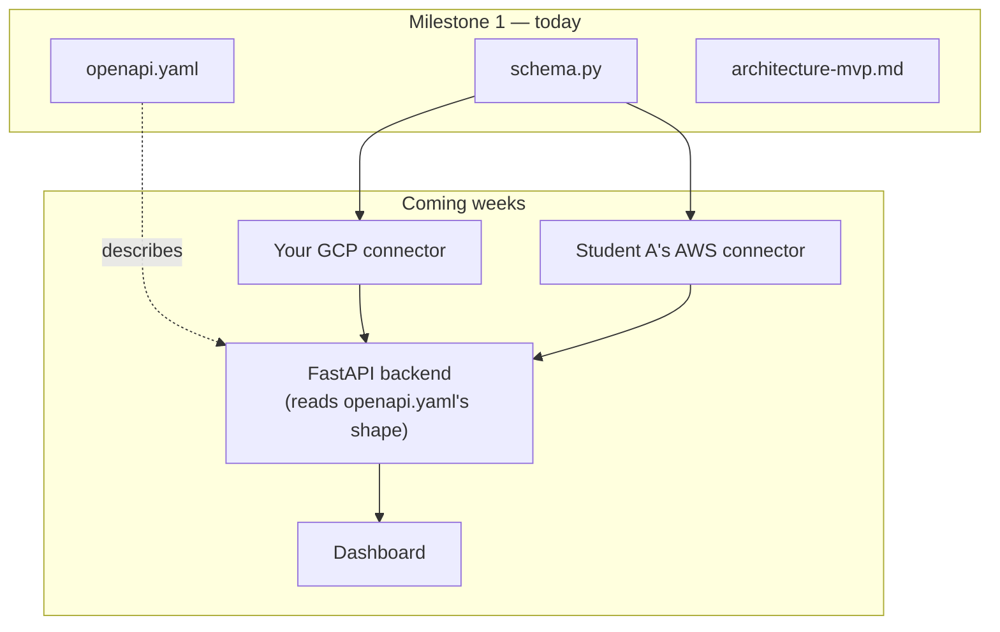

# Milestone 1 Implementation Guide — Windows Edition
### Student B — Freezing the Shared Schema & API Contract

> Phase 1 deliverable. Read this whole guide once before touching a terminal. Then work through **Step 1 → Step
> 13** in order, replying **"Done"** after each one — I'll verify it before we move on.

---

## 📋 Table of contents

1. [Objective of Milestone 1](#1-objective-of-milestone-1)
2. [Expected final architecture](#2-expected-final-architecture)
3. [Role of every file and folder](#3-role-of-every-file-and-folder)
4. [Windows prerequisites](#4-windows-prerequisites)
5. [Environment setup](#5-environment-setup)
6. [Project structure](#6-project-structure)
7. [Implementation steps](#7-implementation-steps)
8. [Concepts reference](#8-concepts-reference)
9. [Best practices & clean code](#9-best-practices--clean-code)
10. [Common beginner mistakes (Windows-specific)](#10-common-beginner-mistakes-windows-specific)
11. [Testing steps](#11-testing-steps)
12. [Debugging tips](#12-debugging-tips)
13. [Security considerations](#13-security-considerations)
14. [Final checklist & Definition of Done](#14-final-checklist--definition-of-done)

---

## 1. Objective of Milestone 1

Produce three artifacts, agreed jointly with Student A, that everything else in this project will depend on:

1. `scanner/schema.py` — a Pydantic model defining the exact shape every cloud connector's output must have.
2. `openapi.yaml` — a written, human-readable specification of what the future API will accept and return.
3. `docs/architecture/architecture-mvp.md` — a short record of *why* you made these choices.

Nothing here needs to run against a real cloud account yet, and no FastAPI server needs to actually serve
requests yet — that comes later. Today is pure **data-shape design**.

## 2. Expected final architecture



**Why FastAPI is mentioned even though we're not building it today:** `openapi.yaml` isn't just documentation —
it's the exact specification FastAPI will later auto-generate interactive docs from, and validate real requests
against. Understanding that connection now makes Step 9 feel purposeful instead of arbitrary.

## 3. Role of every file and folder

| Path | Role |
|---|---|
| `scanner/__init__.py` | Makes `scanner` an importable Python package (can be empty) |
| `scanner/schema.py` | The enforced data contract — imported by every connector, later by the API |
| `openapi.yaml` | The human/tool-readable twin of the same contract |
| `docs/architecture/architecture-mvp.md` | Written rationale — why the contract looks the way it does |
| `tests/test_schema.py` | Automated proof the contract behaves correctly |
| `requirements.txt` | Exact package versions, so anyone (including future-you) can reproduce your setup |
| `.gitignore` | Tells Git which files/folders never belong in version control |

## 4. Windows prerequisites

Install these, in this order, before touching a terminal:

| Tool | Where to get it | Why you need it |
|---|---|---|
| Python 3.11+ | [python.org/downloads](https://www.python.org/downloads/) | The language everything is written in |
| Git for Windows | [git-scm.com/download/win](https://git-scm.com/download/win) | Version control, and gives you Git Bash as a bonus terminal |
| VS Code | [code.visualstudio.com](https://code.visualstudio.com/) | Your editor |
| VS Code extension: **Python** (by Microsoft) | Inside VS Code's Extensions panel | Syntax highlighting, IntelliSense, venv detection |
| VS Code extension: **YAML** (by Red Hat) | Inside VS Code's Extensions panel | Catches YAML indentation mistakes as you type |

> ⚠️ **Critical Windows-specific step:** when installing Python, **check the box "Add python.exe to PATH"** on
> the very first installer screen. If you miss this, typing `python` in a terminal later will fail with
> `'python' is not recognized as an internal or external command` — the single most common Windows setup mistake.

**Which terminal to use:** PowerShell (comes with Windows) is recommended for this guide — all commands below are
written for it. Git Bash (installed alongside Git for Windows) also works and uses macOS/Linux-style commands if
you prefer those instead.

## 5. Environment setup

Covered in detail in Step 1–3 below (Section 7) — this section just previews *why* each tool matters:

- **Virtual environment (`venv`)** — an isolated Python installation just for this project, so packages here never
  conflict with any other Python project on your machine.
- **pip** — Python's package installer, used inside your activated venv.
- **Git** — tracks every change, and is how Student A reviews your work via a Pull Request.

## 6. Project structure

```
copilot-grc-multicloud/
├── .venv/                          (not committed)
├── .gitignore
├── requirements.txt
├── openapi.yaml
├── docs/
│   └── architecture/
│       └── architecture-mvp.md
├── scanner/
│   ├── __init__.py
│   └── schema.py
├── tests/
│   └── test_schema.py
└── journal.md
```

Create these folders empty first, before writing any code inside them — Step 1 does exactly this.

---

## 7. Implementation steps

> Work through these **in order**. After each one, reply **"Done"** and I'll check it before we continue.

### 🔲 Step 1 — Create the project folder and virtual environment

**Objective:** an isolated, version-controlled Python environment.

```powershell
mkdir copilot-grc-multicloud
cd copilot-grc-multicloud
python -m venv .venv
.venv\Scripts\Activate.ps1
```

> ⚠️ **Windows-specific gotcha:** if `.venv\Scripts\Activate.ps1` fails with a message about "running scripts is
> disabled on this system," PowerShell's execution policy is blocking it. Fix it once, for your user only, with:
> ```powershell
> Set-ExecutionPolicy -Scope CurrentUser -ExecutionPolicy RemoteSigned
> ```
> Then re-run the activate command. This is safe and standard for development machines.

**Verify it worked:**
```powershell
where python
```
**Expected output:** the *first* path listed should be inside your project's `.venv` folder.

**Checklist:** [ ] folder created [ ] venv created [ ] venv activated [ ] `where python` shows the `.venv` path first

---

### 🔲 Step 2 — Install dependencies

```powershell
pip install pydantic pyyaml pytest
pip freeze > requirements.txt
```

**Verify it worked:**
```powershell
python -c "import pydantic, yaml, pytest; print('Environment ready')"
```
**Expected output:** `Environment ready`.

**Checklist:** [ ] all 3 packages installed [ ] `requirements.txt` created and non-empty

---

### 🔲 Step 3 — Set up Git

Create a file named `.gitignore` with this content:
```
.venv/
__pycache__/
*.pyc
.pytest_cache/
.env
```

```powershell
git init
git checkout -b feature/b-milestone1-schema
git add .gitignore requirements.txt
git commit -m "chore: initial project setup"
```

**Verify it worked:**
```powershell
git log --oneline
git status
```
**Expected output:** one commit listed; `git status` shows nothing from `.venv` as untracked.

**Checklist:** [ ] `.gitignore` created [ ] first commit made [ ] on a feature branch, not `main`

---

### 🔲 Step 4 — Create the package skeleton

```powershell
mkdir scanner
mkdir docs\architecture
mkdir tests
New-Item scanner\__init__.py -ItemType File
```

**Checklist:** [ ] `scanner/__init__.py` exists and is empty [ ] `docs\architecture\` and `tests\` folders exist

---

### 🔲 Step 5 — Agree the schema with Student A (before writing code)

Talk through, out loud, together:
1. What's the smallest set of fields every cloud resource will always have, regardless of provider or type?
2. What field identifies which cloud a resource came from, and what are the only valid values?
3. Should the original, un-translated API response be kept anywhere?

**Checklist:** [ ] both of you can restate the agreed answers in your own words, without notes

---

### 🔲 Step 6 — Write the first version of `scanner/schema.py`

```python
from typing import Literal
from pydantic import BaseModel


class NormalizedResource(BaseModel):
    """One cloud resource, normalized to a common shape."""

    cloud_provider: Literal["aws", "azure", "gcp"]
    resource_type: str
    resource_id: str
```

**Verify it worked:**
```powershell
python -c "from scanner.schema import NormalizedResource; print('Import OK')"
```

**Checklist:** [ ] file created [ ] import runs with no error

---

### 🔲 Step 7 — Add the remaining fields, one at a time

Add `raw_data`, `region`, and `collected_at`:

```python
from datetime import datetime, timezone
from typing import Literal, Optional
from pydantic import BaseModel, Field


class NormalizedResource(BaseModel):
    """One cloud resource, normalized to a common shape."""

    cloud_provider: Literal["aws", "azure", "gcp"]
    resource_type: str
    resource_id: str
    region: Optional[str] = None
    raw_data: dict
    collected_at: datetime = Field(default_factory=lambda: datetime.now(timezone.utc))

    class Config:
        json_encoders = {datetime: lambda dt: dt.isoformat()}
```

**Checklist:** [ ] all 6 fields present [ ] you can explain, out loud, why each one exists

---

### 🔲 Step 8 — Manually test it, including trying to break it

```powershell
python -c "from scanner.schema import NormalizedResource; r = NormalizedResource(cloud_provider='gcp', resource_type='storage_bucket', resource_id='test', raw_data={}); print(r.model_dump_json(indent=2))"
```
**Expected output:** formatted JSON with all 6 fields.

Now deliberately break it:
```powershell
python -c "from scanner.schema import NormalizedResource; NormalizedResource(cloud_provider='Gcp', resource_type='x', resource_id='y', raw_data={})"
```
**Expected output:** a `ValidationError` complaining `'Gcp'` isn't valid.

**Checklist:** [ ] valid data works [ ] invalid data correctly raises an error

---

### 🔲 Step 9 — Write `openapi.yaml`

```yaml
openapi: 3.0.3
info:
  title: Copilot GRC Multi-Cloud API
  version: "0.1.0"
paths:
  /findings:
    get:
      summary: List normalized findings across all connected clouds
      responses:
        "200":
          description: A list of normalized resources
          content:
            application/json:
              schema:
                type: array
                items:
                  $ref: "#/components/schemas/NormalizedResource"
components:
  schemas:
    NormalizedResource:
      type: object
      required: [cloud_provider, resource_type, resource_id, raw_data, collected_at]
      properties:
        cloud_provider:
          type: string
          enum: [aws, azure, gcp]
        resource_type:
          type: string
        resource_id:
          type: string
        region:
          type: string
          nullable: true
        raw_data:
          type: object
        collected_at:
          type: string
          format: date-time
```

**Checklist:** [ ] file created at the project root [ ] every field matches `schema.py`, spelled identically

---

### 🔲 Step 10 — Validate the YAML

```powershell
python -c "import yaml; yaml.safe_load(open('openapi.yaml')); print('Valid YAML')"
```
**Expected output:** `Valid YAML`.

> ⚠️ If this fails, check indentation first — VS Code sometimes inserts tabs instead of spaces on Windows unless
> configured otherwise. In VS Code, bottom-right corner, click the indentation indicator and choose "Indent Using
> Spaces."

**Checklist:** [ ] prints `Valid YAML` with no error

---

### 🔲 Step 11 — Write `docs/architecture/architecture-mvp.md`

5–10 sentences, agreed with Student A: why normalization matters, what the first resource types will be, who owns
which connector.

**Checklist:** [ ] written [ ] both students have read and agree with it

---

### 🔲 Step 12 — Write automated tests

`tests/test_schema.py`:
```python
import pytest
from pydantic import ValidationError
from scanner.schema import NormalizedResource


def test_valid_resource_is_accepted():
    r = NormalizedResource(cloud_provider="gcp", resource_type="storage_bucket", resource_id="x", raw_data={})
    assert r.cloud_provider == "gcp"


def test_invalid_cloud_provider_is_rejected():
    with pytest.raises(ValidationError):
        NormalizedResource(cloud_provider="Gcp", resource_type="x", resource_id="y", raw_data={})
```

```powershell
pytest tests\ -v
```
**Expected output:** 2 tests, both `PASSED`.

**Checklist:** [ ] both tests pass

---

### 🔲 Step 13 — Commit, push, open a Pull Request

```powershell
git add scanner\ openapi.yaml docs\ tests\
git commit -m "feat: freeze normalized schema and API contract (paired with Student A)"
git push -u origin feature/b-milestone1-schema
```
Then open a Pull Request on GitHub and request Student A's review.

**Checklist:** [ ] everything committed [ ] pushed [ ] PR opened

---

## 8. Concepts reference

### Python concepts used
- **Virtual environments** — project-level isolation for installed packages.
- **Type hints** (`str`, `Optional[str]`, `Literal[...]`) — declaring what kind of value a variable should hold.
- **Packages** (`__init__.py`) — what makes a folder importable as `scanner.schema`.

### FastAPI concepts (previewed, not implemented yet)
FastAPI is a Python web framework that will later read a specification shaped exactly like `openapi.yaml` and use
it to (a) validate incoming requests automatically and (b) generate a live, interactive documentation page. You're
not writing any FastAPI code today — but everything in `openapi.yaml` is written with that future consumer in
mind, which is why field names and required/optional status matter so much right now.

### Pydantic concepts used
- `BaseModel` — the parent class every schema inherits from; validates its own fields automatically.
- `Literal["a", "b", "c"]` — restricts a field to an exact, fixed set of values.
- `Optional[X]` — the field can be `X` or `None`.
- `Field(default_factory=...)` — generates a fresh default value every time a new object is created.
- `ValidationError` — raised immediately when data doesn't match the schema.

### API design principles
- **Contract-first design** — agree the shape before writing implementation logic behind it.
- **Required vs. optional fields, decided deliberately** — not everything needs to always be present (see
  `region`).
- **One schema, reused everywhere** — defined once in `openapi.yaml`'s `components/schemas`, referenced via `$ref`
  rather than repeated.

---

## 9. Best practices & clean code

- One class, one responsibility — `NormalizedResource` describes data shape only, nothing else.
- Docstrings explaining *why* a file exists, not just what it contains.
- Small, frequent, clearly-labeled Git commits — not one giant commit at the end.
- Never edit a shared file (`schema.py`, `openapi.yaml`) solo — always a conversation first.

## 10. Common beginner mistakes (Windows-specific)

| Mistake | Why it happens on Windows | Fix |
|---|---|---|
| `'python' is not recognized...` | Python wasn't added to PATH during install | Reinstall Python, checking "Add python.exe to PATH" |
| PowerShell blocks `Activate.ps1` | Default execution policy disallows scripts | `Set-ExecutionPolicy -Scope CurrentUser -ExecutionPolicy RemoteSigned` |
| YAML parsing fails mysteriously | Editor inserted tabs instead of spaces | Set VS Code to "Indent Using Spaces" |
| Paths with backslashes break in Python strings | Windows uses `\`, Python treats it as an escape character | Use raw strings (`r"C:\path"`) or forward slashes, which Python accepts on Windows too |
| Line-ending warnings from Git (`LF will be replaced by CRLF`) | Windows and Unix use different line endings | Safe to ignore for this project; Git handles the conversion |

## 11. Testing steps

After every step that produces or changes code, run the fastest relevant check:
- After Step 6/7: the manual `python -c "..."` import check.
- After Step 8: both the "valid data" and "deliberately broken" manual checks.
- After Step 10: the YAML validation one-liner.
- After Step 12: the full `pytest tests\ -v` suite.

Never move to the next step with a failing check from the current one.

## 12. Debugging tips

1. Read the **entire** error message, bottom to top, before assuming what's wrong.
2. Reproduce the failure in the smallest possible one-line command.
3. Print the actual value (`print(type(x), x)`) if the cause isn't obvious.
4. Check official docs before assuming a library is broken.

## 13. Security considerations

- `.env` and any future credential files are excluded via `.gitignore` from the very first commit — never added
  "temporarily."
- No secrets exist yet in Milestone 1 (that starts in Milestone 2, with your GCP service account) — but the habit
  starts now.
- Treat the shared schema as a security-relevant artifact too: a sloppy contract is how inconsistent, unvalidated
  data quietly slips into a system that's supposed to be auditing *other* systems for exactly that kind of
  sloppiness.

## 14. Final checklist & Definition of Done

- [ ] Steps 1–13 all complete, in order
- [ ] `schema.py`, `openapi.yaml`, `architecture-mvp.md`, and `tests/test_schema.py` all exist and are committed
- [ ] Both manual and automated tests pass
- [ ] A Pull Request is open for Student A's review
- [ ] You can explain, without notes, why this milestone had to come before any connector code

---

**Ready for Phase 2.** Work through Step 1 now, and reply **"Done"** when it's complete — I'll verify it before we
move to Step 2.
