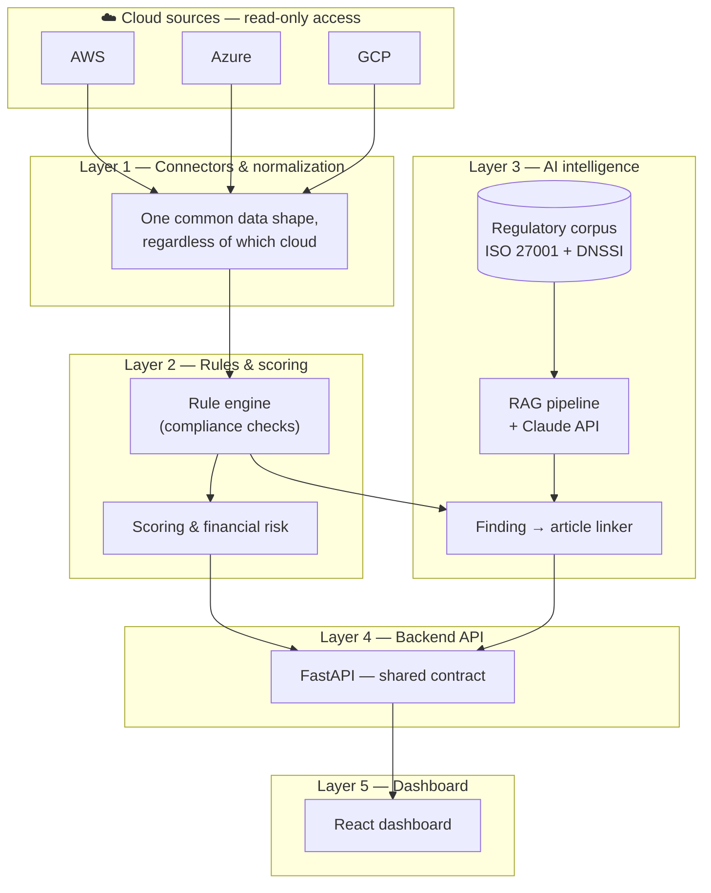
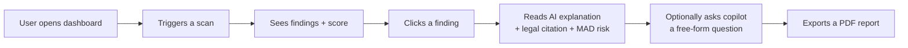
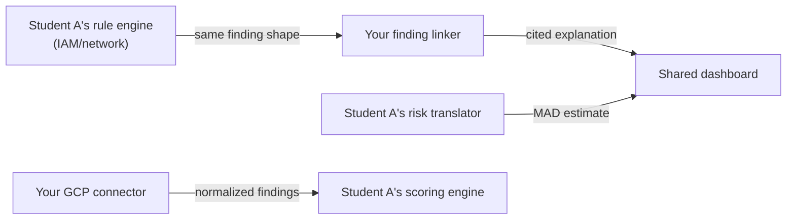
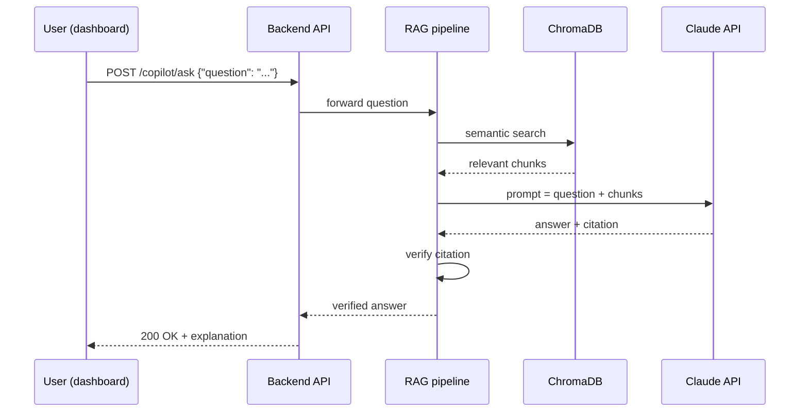
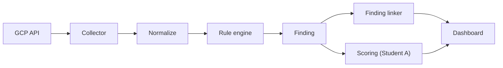
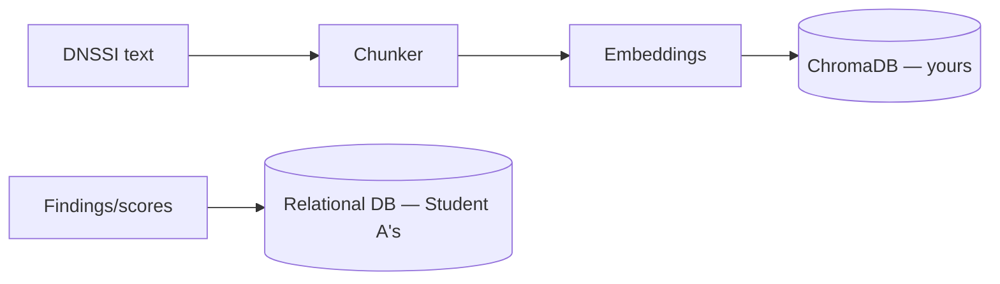
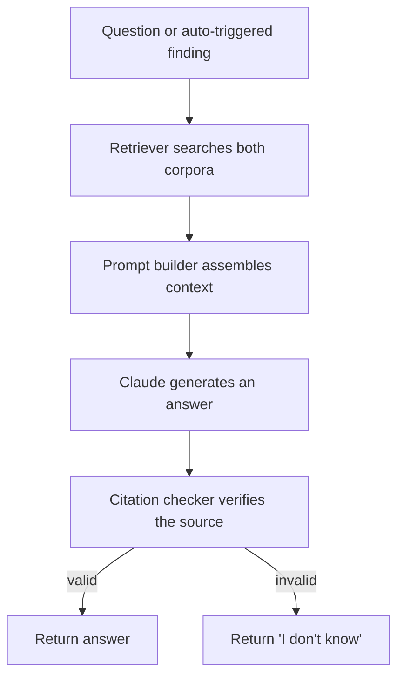

# 🧭 The Complete Compass
### Student B's Guide to Copilot GRC Multi-Cloud — Understand Everything Before You Build Anything

> This is not a coding tutorial. This is your personal textbook — read it before you write a single line of
> code, so that every line you eventually write has a reason behind it.

---

## 📖 Table of contents

1. [Welcome to the project](#part-1--welcome-to-the-project)
2. [The big picture](#part-2--the-big-picture)
3. [Student B's mission](#part-3--student-bs-mission)
4. [Learn before you build](#part-4--learn-before-you-build)
5. [Technology deep dive](#part-5--technology-deep-dive)
6. [Project structure](#part-6--project-structure)
7. [Complete learning roadmap](#part-7--complete-learning-roadmap)
8. [Student B implementation roadmap](#part-8--student-b-implementation-roadmap)
9. [Understanding the entire workflow](#part-9--understanding-the-entire-workflow)
10. [Professional development workflow](#part-10--professional-development-workflow)
11. [Beginner survival guide](#part-11--beginner-survival-guide)
12. [Final checklist](#part-12--final-checklist)

> 🎮 **How to read this:** each Part is a Chapter. Each Chapter ends with a **Mission Complete ✅** box. Don't move
> to the next Chapter until you can tick every box honestly — this isn't a race, it's a foundation.

---

## Part 1 — 🌍 Welcome to the project

### Once upon a time...

Imagine a small Moroccan company that just moved its infrastructure to the cloud — a bit on Amazon, a bit on
Microsoft, a bit on Google, because different teams picked different tools at different times. Nobody has one
place to answer a simple question: **"are we secure and compliant, across all of it, right now?"**

Today they'd need three different consoles, three different mental models, and — if they want to know whether
they comply with Moroccan cybersecurity law (Loi 05-20/DNSSI) — a very expensive outside consultant who reads
technical reports and manually translates them into legal language.

**Copilot GRC Multi-Cloud exists to close that gap.**

### What is this project?

A platform that:
1. Scans **AWS, Microsoft Azure, and Google Cloud Platform** for security misconfigurations, from one place.
2. Uses an **AI copilot** to automatically explain *why* each finding matters — citing the exact ISO 27001 control
   and the exact Moroccan Loi 05-20/DNSSI article it violates, never a made-up reference.
3. Translates every finding into an **estimated financial exposure in Moroccan dirhams (MAD)** — because "critical
   severity" means little to a director, but "this could cost 150,000 MAD" gets a meeting scheduled.

### Why was it created?

Because every existing tool solves *part* of this problem, never the whole thing:

| Existing tool | What it does well | What it's missing |
|---|---|---|
| Wiz, Orca, Prisma Cloud | Beautiful multi-cloud dashboards | $50-100k/year, generic international frameworks only |
| Prowler, ScoutSuite | Free, open-source, solid checks | Command-line heavy, no legal/regulatory bridge |
| Native cloud consoles (AWS/Azure/GCP) | Built-in, free | Only see their own cloud, never the other two |
| A human PASSI consultant | Expert Moroccan legal knowledge | Expensive, slow, done once a quarter at best |

Nobody combines "scans all 3 clouds" with "explains findings in Moroccan legal terms" with "tells you the money
at stake." That gap is this project's entire reason to exist.

### What problem does it solve, concretely?

> 💡 **Did You Know?** A misconfigured, publicly-readable storage bucket is one of the most common real-world
> breach causes — not because attackers are clever, but because automated internet-wide scanners find them within
> *minutes* of creation. This project's whole job is to find that bucket before an attacker's scanner does.

### Who will use it?

- A **security engineer** who needs one dashboard instead of three browser tabs.
- A **compliance officer / RSSI** who needs to answer "are we DNSSI-compliant?" without translating jargon by hand.
- A **director / decision-maker** who needs to know which finding to fix *first*, ranked by real financial risk.

### What will the final application be capable of?

By the end of this internship, running one scan should let someone:
- See a single compliance score, broken down by cloud provider and security domain.
- Click any finding and get a plain-language explanation, with a real citation to the law or standard it violates.
- See an estimated dirham exposure for that finding.
- Ask the copilot a free-form question ("are we compliant with DNSSI's logging requirements?") and get a sourced
  answer.
- Export a PDF report suitable for an actual audit conversation.

### What does success look like for *you*, Student B?

Not "I wrote code that runs." Success is: **you can explain, without notes, why every piece of your work exists**
— to a jury, to a future employer, to yourself six months from now.

### ✅ Mission Complete — Chapter 1

- [ ] I can explain, in my own words, what this project does, to someone who's never heard of it.
- [ ] I can name at least 2 things this project does that Wiz/Prowler/a native console *cannot*.
- [ ] I understand this project has 3 target users, not just "developers."

---

## Part 2 — 🗺️ The big picture

### The complete architecture



### Every major component, explained in one sentence each

| Component | One-sentence explanation |
|---|---|
| Cloud connectors | Read (never write) configuration data from each cloud's API |
| Normalization layer | Converts 3 different data shapes into 1 shared shape |
| Rule engine | Checks normalized data against compliance rules (e.g. "is this bucket public?") |
| Scoring | Aggregates rule results into a single, readable compliance score |
| Regulatory corpus | ISO 27001 and DNSSI texts, chunked and stored for AI search |
| RAG pipeline | Finds relevant regulatory text and asks Claude to explain a finding, with a citation |
| Finding→article linker | Automatically triggers the RAG pipeline the moment a finding is detected |
| Financial risk translator | Converts a finding into an estimated MAD sanction range |
| Backend API | The single door through which the dashboard talks to everything else |
| Dashboard | Where a human actually sees and interacts with all of this |

### How components communicate

They **never** call each other directly and randomly — every piece talks through a clearly defined shape (the
normalized schema, and the API contract). This is the single idea that makes a 2-person team building in parallel
actually work.

### The complete user journey



### Where Student A and Student B fit

> 🅰️ **This is Student A's responsibility:** the AWS connector, the IAM/network rule domains, the relational
> database (findings/scores/audit trail persistence), the scoring + RBAC + audit-log backend, the ISO 27001
> corpus, the financial risk translator, and the score/radar/risk-badge half of the dashboard.

> 🅱️ **This is Student B's responsibility (that's you!):** the GCP connector, the encryption/logging/storage rule
> domains, the DNSSI/Loi 05-20 corpus (ChromaDB), the finding→article linker, the evaluation of the copilot's
> quality, and the findings-list/copilot-chat half of the dashboard.

> 🤝 **Jointly owned by both of you:** the shared data schema and API contract, the Azure connector (the "third
> cloud" neither of you owns alone), the core RAG pipeline (retriever + prompt builder + Claude integration +
> citation checker), end-to-end integration, security hardening, and the final report.

### Why this split, and why it matters that you understand it

Notice: you don't own "the frontend" and Student A doesn't own "the backend." You each own a **full vertical
slice** — from a cloud API, through rules, to a piece of the UI. That's deliberate: it means you'll leave this
internship having touched every *kind* of work a real engineer does, not just one layer of it.

### ✅ Mission Complete — Chapter 2

- [ ] I can draw the architecture diagram from memory (even roughly).
- [ ] I can say, without checking, which 3 things are jointly owned by both students.
- [ ] I understand *why* components only communicate through a shared, agreed shape.

---

## Part 3 — 🎯 Student B's mission

### Everything you own, solo

| Task | Why it matters |
|---|---|
| **GCP connector** | GCP is a third of the "multi-cloud" promise — without it, the product only covers 2 clouds |
| **Rule engine: encryption, logging, storage domains** | These are 3 of the most common real-world misconfiguration categories, across *any* cloud |
| **DNSSI / Loi 05-20 corpus (ChromaDB)** | This is the project's actual competitive edge — no other tool has this |
| **Finding → article linker** | Turns a silent finding into a self-explaining one — the product's signature feature |
| **Evaluation of the copilot** | Proves the AI doesn't hallucinate — without this, nobody should trust it |
| **Dashboard: findings list + copilot chat** | Where a human actually experiences your AI work |

### Everything you own jointly, with Student A

| Task | Why it's shared |
|---|---|
| **Data schema & API contract** | The one thing both of your solo work depends on — must be agreed, not assumed |
| **Azure connector** | Neither of you owns it alone, so neither of you skips understanding a 3rd cloud's IAM model |
| **Core RAG pipeline** | The single highest-risk, highest-value component — built by two people on purpose |
| **End-to-end integration** | Where your work and Student A's work are proven to actually fit together |
| **Security hardening** | Applies equally to both codebases |
| **Final report & defense** | A shared story, not two separate ones |

### How your work depends on Student A's (and vice versa)



You depend on Student A for exactly one thing at the start: **the frozen schema**. After that, your solo work
(GCP, DNSSI corpus, dashboard chat) can proceed independently — you only truly need to sync again at the two
paired sessions (Azure, RAG core) and at integration.

### Expected deliverables (the concrete, checkable artifacts)

- `scanner/collectors/gcp.py` — working GCP connector
- `rules/encryption.yaml`, `rules/logging.yaml`, `rules/storage.yaml` — your rule domains
- An indexed DNSSI ChromaDB collection
- `copilot/finding_linker.py`
- `evaluation/report.md` — a real quality assessment, not a vibe check
- React components: findings list + copilot chat

### ✅ Mission Complete — Chapter 3

- [ ] I can list all 6 things I own solo, without looking.
- [ ] I can explain why the Azure connector and the RAG core are shared, not solo.
- [ ] I understand the one thing I depend on Student A for at the very start.

---

## Part 4 — 📚 Learn before you build

> Foundational ideas first — the "why this whole field works the way it does," before any specific tool.

### 4.1 What is "GRC" (Governance, Risk, and Compliance)?

- **Simply put:** GRC is the discipline of making sure an organization follows the rules (compliance), understands
  what could go wrong (risk), and has a structure to manage both (governance).
- **Why it exists:** organizations that don't manage these three things systematically eventually get breached,
  fined, or both — often at the same time.
- **When it's used:** any time an organization needs to prove, to itself or a regulator, that it's taking security
  seriously.
- **Beginner example:** a company asking "which of our cloud accounts would fail an audit tomorrow?" is asking a
  GRC question.
- **Analogy:** GRC is like a household's fire safety — governance is having a fire escape plan, risk is knowing
  which room has the faulty wiring, compliance is meeting the local fire code.
- **Common mistake:** treating GRC as "paperwork" rather than something a real tool (like the one you're building)
  can actively help with.

### 4.2 What is cloud security posture management (CSPM)?

- **Simply put:** continuously checking cloud accounts for misconfigurations that create security risk.
- **Why it exists:** cloud misconfigurations (a public bucket, an open firewall port) are one of the most common
  real breach causes, and they're easy to introduce by accident.
- **When it's used:** continuously, ideally — not just once a year during an audit.
- **Analogy:** CSPM is a smoke detector for your cloud accounts — it doesn't prevent every fire, but it catches
  the ones you didn't notice yourself.
- **Common mistake:** thinking "we set it up securely once" is the same as "it's still secure today" — permissions
  and configurations drift over time.

### 4.3 What is a rule engine, conceptually (before any code)?

- **Simply put:** a system that expresses "what good looks like" as a list of checkable rules, then checks reality
  against that list.
- **Why it exists:** hardcoding checks directly in application logic doesn't scale — separating "the rule" from
  "the thing that checks rules" lets you add new rules without rewriting the checker.
- **Analogy:** a rule engine is a restaurant health inspector's checklist — the inspector (engine) is generic; the
  checklist items (rules) are what actually varies.

### 4.4 What is a REST API, conceptually?

- **Simply put:** a way for two pieces of software to talk to each other over the internet using predictable
  patterns (ask for something, get something back).
- **Why it exists:** without a standard, every integration between two systems would need its own custom protocol.
- **Analogy:** a REST API is a restaurant menu — you don't need to know how the kitchen works, you just need to
  know what you can order and what you'll get back.

### 4.5 What is AI retrieval (before the acronym "RAG")?

- **Simply put:** instead of asking an AI to answer purely "from memory," you first find the most relevant real
  documents, then hand those to the AI and say "answer using only this."
- **Why it exists:** AI models can state things confidently that aren't true ("hallucinate") — grounding the answer
  in real, retrieved text reduces that risk dramatically.
- **Analogy:** it's the difference between asking someone to recall a law from memory versus handing them the
  actual legal text and asking them to summarize *that*.

### 4.6 What is "normalization" of data?

- **Simply put:** taking data that looks different depending on its source, and converting it into one consistent
  shape everything downstream can rely on.
- **Why it exists:** without it, every piece of code that uses cloud data would need a separate version per cloud
  provider.
- **Analogy:** a universal power adapter — three countries' different plug shapes all become one standard socket.

### ✅ Mission Complete — Chapter 4

- [ ] I can explain GRC, CSPM, a rule engine, a REST API, RAG, and normalization — each in one sentence, no jargon.
- [ ] I understand these are general ideas that exist independently of any specific tool or company.

---

## Part 5 — 🔬 Technology deep dive (Student B's stack)

For each technology below: what it is, why it exists, the problem it solves, how it works, where *you'll* use it,
alternatives, advantages, and disadvantages.

### 5.1 Python

- **What:** a general-purpose programming language known for readability.
- **Why we use it:** it has mature, official libraries for every cloud provider and for AI/data work — the whole
  backend, scanner, and AI layer of this project are Python.
- **Where you'll use it:** literally everywhere in your backend/AI work (not the React dashboard, which is
  JavaScript).
- **Alternatives:** Node.js, Go, Java — all viable for backend work, but with weaker AI/data-science ecosystems.
- **Advantages:** huge ecosystem, readable syntax, excellent for both APIs and AI work.
- **Disadvantages:** slower raw execution speed than compiled languages — rarely a real constraint for this project.

### 5.2 Google Cloud SDKs (`google-cloud-storage`, `google-api-python-client`)

- **What:** official Python libraries for talking to GCP's APIs.
- **Why we use it:** your solo cloud connector needs a reliable, well-documented way to read GCP resources.
- **Problem it solves:** without an SDK, you'd need to hand-craft raw HTTP requests and handle authentication
  yourself.
- **Where you'll use it:** `scanner/collectors/gcp.py`.
- **Alternatives:** raw REST calls with `requests` (much more manual, error-prone).
- **Advantages:** official, well-documented, handles authentication for you.
- **Disadvantages:** two slightly different usage patterns across GCP services (dedicated libraries vs. the
  generic "discovery" client) — a small learning curve, not a real downside once understood.

### 5.3 Pydantic

- **What:** a data-validation library — you define a data shape as a Python class, and it enforces that shape.
- **Why we use it:** the shared schema (Part 2/3) needs to be *enforced* in code, not just agreed in a document.
- **Problem it solves:** plain dictionaries don't catch typos or wrong types — Pydantic does, immediately.
- **Where you'll use it:** the shared `NormalizedResource` schema, and every API request/response shape.
- **Alternatives:** plain dataclasses (no validation), manual dictionary checks (tedious, error-prone).
- **Advantages:** clear errors, automatic documentation generation when paired with FastAPI.
- **Disadvantages:** a small learning curve around its validation rules — worth it immediately.

### 5.4 ChromaDB

- **What:** an open-source vector database — stores text as searchable "meaning vectors."
- **Why we use it:** your DNSSI corpus needs to be found by *meaning*, not exact keyword match.
- **Problem it solves:** keyword search fails when a question and the source text use different wording for the
  same idea.
- **Where you'll use it:** indexing and querying the DNSSI/Loi 05-20 corpus.
- **Alternatives:** Pinecone, Weaviate (both are paid/hosted services — ChromaDB runs free, locally).
- **Advantages:** free, simple Python API, no external service dependency.
- **Disadvantages:** less suited to massive-scale production use than hosted alternatives — a non-issue at this
  project's scale.

### 5.5 RAG & (optionally) LangChain

- **What:** the retrieval-then-generate pattern (Part 4.5), optionally assembled using LangChain's building
  blocks.
- **Why we use it:** it's the only realistic way to guarantee your copilot's citations are real, not invented.
- **Where you'll use it:** the finding→article linker builds directly on top of the shared RAG core.
- **Alternatives:** fine-tuning a model on your corpus (expensive, slow to update, and still doesn't guarantee
  grounded citations) — RAG is the industry-standard approach for exactly this reason.
- **Advantages:** groundable, updatable just by changing the corpus, no retraining needed.
- **Disadvantages:** retrieval quality directly limits answer quality — a weak retriever means weak answers no
  matter how good the underlying model is.

### 5.6 Claude API (Anthropic)

- **What:** an API that lets your code send a prompt and receive a generated response from a Claude model.
- **Why we use it:** it's the reasoning engine that turns retrieved regulatory text into a clear, human
  explanation.
- **Where you'll use it:** inside the shared RAG pipeline, and inside your finding linker's prompt.
- **Alternatives:** other LLM providers — the concepts transfer, but this project standardizes on Claude.
- **Advantages:** strong instruction-following, good for constrained, citation-disciplined prompts.
- **Disadvantages:** it's an external API call — latency and (small) cost per call, and it requires careful prompt
  design to enforce "don't invent a citation."

### 5.7 FastAPI

- **What:** a modern Python web framework for building APIs.
- **Why we use it:** it auto-generates interactive documentation from your code, which is exactly how you and
  Student A hand each other a working contract.
- **Where you'll use it:** your copilot/chat endpoints.
- **Alternatives:** Flask (more manual, no automatic validation/docs), Django (much heavier than this project
  needs).
- **Advantages:** fast to build with, automatic validation via Pydantic, automatic docs.
- **Disadvantages:** relatively newer than Flask/Django — a smaller (but very active) plugin ecosystem.

### 5.8 React (+ Recharts)

- **What:** a JavaScript library for building user interfaces from reusable components.
- **Why we use it:** the industry standard for interactive dashboards; Recharts adds ready-made charts.
- **Where you'll use it:** the findings list and copilot chat components.
- **Alternatives:** Vue, Svelte — all viable, but React has the largest ecosystem and most available help online.
- **Advantages:** component reusability, huge community, works well with a REST backend.
- **Disadvantages:** some initial concepts (state, props, hooks) take a beginner a little time to click — worth
  the investment.

### 5.9 Docker

- **What:** a way to package an application with everything it needs into a portable "container."
- **Why we use it:** guarantees your service runs the same way on your laptop, Student A's laptop, and wherever
  it's finally deployed.
- **Where you'll use it:** packaging the copilot/frontend services.
- **Alternatives:** manually documenting setup steps (fragile, "works on my machine" risk).
- **Advantages:** consistency, easy to run multiple services together (`docker-compose`).
- **Disadvantages:** another concept to learn — but a genuinely standard, transferable industry skill.

### 5.10 pytest

- **What:** Python's most common testing framework.
- **Why we use it:** you need automated proof your code works, not just "I ran it once and it looked fine."
- **Where you'll use it:** testing your connector, rule domains, linker, and dashboard logic.
- **Alternatives:** `unittest` (Python's built-in option, more verbose).
- **Advantages:** simple syntax, powerful mocking support (critical for testing cloud code without live
  credentials).
- **Disadvantages:** none significant for a project this size.

### 5.11 Git & GitHub

- **What:** version control (Git) and a hosting platform for shared repositories (GitHub).
- **Why we use it:** two people building in parallel need a safe way to combine their work without overwriting
  each other.
- **Where you'll use it:** every single day, for every single change.
- **Alternatives:** GitLab, Bitbucket — same core ideas, different hosting platform.

### ✅ Mission Complete — Chapter 5

- [ ] For each of the 11 technologies above, I can say in one sentence why *this specific project* needs it.
- [ ] I understand which ones are "yours" (GCP SDK, ChromaDB, parts of RAG/Claude, FastAPI's copilot routes,
  React chat/findings components) versus shared (schema, core RAG, Docker for both services).

---

## Part 6 — 🗂️ Project structure

```
copilot-grc-multicloud/
├── scanner/
│   ├── schema.py                    (shared — the contract, agreed with Student A)
│   ├── collectors/
│   │   ├── gcp.py                   ⭐ yours — GCP connector
│   │   ├── azure.py                 🤝 shared — paired with Student A
│   │   └── aws.py                   (Student A's)
│   └── rules/
│       ├── encryption.yaml          ⭐ yours
│       ├── logging.yaml             ⭐ yours
│       ├── storage.yaml             ⭐ yours
│       ├── iam.yaml                 (Student A's)
│       └── network.yaml             (Student A's)
├── copilot/
│   ├── corpus/
│   │   ├── dnssi/                   ⭐ yours — source texts + chunking
│   │   └── iso27001/                (Student A's)
│   ├── build_index.py               🤝 shared
│   ├── retriever.py                 🤝 shared — core RAG
│   ├── rag_pipeline.py              🤝 shared — core RAG
│   ├── citation_checker.py          🤝 shared — core RAG
│   └── finding_linker.py            ⭐ yours — built on top of the shared core
├── backend/
│   └── routes/
│       └── copilot.py               ⭐ yours
├── frontend/src/components/
│   ├── FindingsList.jsx              ⭐ yours
│   └── CopilotChat.jsx               ⭐ yours
├── evaluation/
│   ├── golden_dataset.json           ⭐ yours
│   └── report.md                     ⭐ yours
├── docs/architecture/architecture-mvp.md   🤝 shared
├── openapi.yaml                      🤝 shared
└── tests/
    ├── collectors/test_gcp.py        ⭐ yours
    └── copilot/test_linker.py        ⭐ yours
```

| Folder/file | Purpose | When you touch it | Common mistake |
|---|---|---|---|
| `scanner/schema.py` | The single source of truth for data shape | Only with Student A's agreement | Editing it solo "just this once" |
| `scanner/collectors/gcp.py` | All your GCP-specific logic | Constantly, Days 2-5 of Week 1 | Leaking GCP-specific field names outside this file |
| `scanner/rules/*.yaml` | Your 3 compliance domains | Week 2 | Writing a rule that assumes GCP-only field names instead of the normalized schema |
| `copilot/corpus/dnssi/` | Raw regulatory text before indexing | Week 2 | Chunking mid-sentence, losing legal meaning |
| `copilot/finding_linker.py` | Your signature feature | Week 4 | Not reusing the shared citation checker — reinventing it badly |
| `evaluation/` | Proof your AI work is trustworthy | Week 5 | Only testing "easy" questions, skipping edge cases |

### ✅ Mission Complete — Chapter 6

- [ ] I can point to where I'd add a new GCP check, a new rule, or a new corpus document, without guessing.
- [ ] I understand which files are safe to edit solo, and which require a conversation with Student A first.

---

## Part 7 — 🎓 Complete learning roadmap

| When | Learn | Why now | Difficulty | Est. time | Practice |
|---|---|---|---|---|---|
| Before Week 1 | Cloud computing basics, IAM concepts, least privilege | Everything else assumes this | 🟢 Easy | 2-3h | Explain "least privilege" to a friend in your own words |
| Before Week 1 | Python venvs, pip, Git basics | You'll use these daily starting Day 1 | 🟢 Easy | 2-3h | Set up a throwaway project with a venv and a git repo |
| Week 1 | Pydantic, REST/API contracts, GCP SDK basics | Needed for the schema + connector | 🟡 Medium | 4-6h | Break your own Pydantic model on purpose, read the error |
| Week 2 | Rule engines / policy-as-code, DNSSI/Loi 05-20 content, embeddings & vector search | Needed for your rule domains + corpus | 🟡 Medium | 6-8h | Write one rule by hand before automating it |
| Week 3 | FastAPI, Azure IAM (RBAC) | Needed for your copilot API + Azure pairing | 🟡 Medium | 5-7h | Build one "hello world" FastAPI endpoint before touching the real one |
| Week 4 | RAG, LangChain (optional), Claude API/prompt engineering | The flagship feature | 🔴 Harder | 8-10h | Build a 5-line RAG "toy" pipeline before touching the real one |
| Week 5 | AI evaluation methodology, React & Recharts | Needed for proving quality + shipping UI | 🟡 Medium | 6-8h | Score 5 of your own copilot's answers like a strict grader |
| Week 6 | Docker, security scanning tools (Bandit/pip-audit/etc.), technical writing | Needed to ship and defend | 🟢 Easy-Medium | 4-6h | Containerize a tiny throwaway app before the real one |

> 💡 **Pro tip:** don't try to learn Week 4's RAG concepts in Week 1 "to get ahead." Concepts stick far better when
> you learn them right before you need them — that's why this roadmap is chronological, not front-loaded.

### ✅ Mission Complete — Chapter 7

- [ ] I know what to study this week, and I'm not trying to learn everything on day one.
- [ ] I've picked one "practice" exercise per topic to actually do, not just read about.

---

## Part 8 — 🧩 Student B implementation roadmap

> This is a milestone map, not a code tutorial — for full step-by-step code, see your separate Day-1 and Week-1
> implementation guides. This section is about *sequencing and reasoning*.

### Milestone 1 — Freeze the shared contract (paired)

- **Objective:** agree a `NormalizedResource` schema and a minimal API contract with Student A.
- **Required knowledge:** Pydantic, REST contracts (Part 5.3, 4.4).
- **Steps:** discuss 3 key questions → write `schema.py` → write `openapi.yaml` → commit → PR review.
- **Files:** `scanner/schema.py`, `openapi.yaml`.
- **Expected output:** a Pydantic class that raises a clear error on invalid data.
- **Testing:** manually construct valid and invalid instances.
- **Common errors:** disagreeing on field names later because you didn't actually finish the conversation first.
- **Why this comes first:** every other milestone below depends on this shape being stable.
- **Mission Complete ✅:** [ ] schema committed [ ] contract committed [ ] Student A has reviewed and approved

### Milestone 2 — GCP connector

- **Objective:** working IAM, Storage, Firewall, and Audit Log collectors.
- **Required knowledge:** GCP SDKs, service accounts, least privilege (Part 5.2, 4.2).
- **Steps:** create sandbox project → service account → implement 4 collector functions → normalize output.
- **Files:** `scanner/collectors/gcp.py`.
- **Expected output:** a list of `NormalizedResource` objects from a real GCP project.
- **Testing:** mocked pytest tests, no live credentials required.
- **Common errors:** using personal credentials instead of a service account; forgetting pagination on firewall
  rules.
- **Why this comes before rules:** you need real data before you can meaningfully check it against rules.
- **Mission Complete ✅:** [ ] all 4 collectors implemented [ ] tests passing [ ] manually verified against sandbox

### Milestone 3 — Rule engine domains (encryption, logging, storage)

- **Objective:** cross-cloud compliance rules for your 3 domains.
- **Required knowledge:** rule engines/policy-as-code (Part 4.3).
- **Steps:** write rules as YAML → map each to an ISO/DNSSI reference → run against your GCP sandbox.
- **Files:** `scanner/rules/encryption.yaml`, `logging.yaml`, `storage.yaml`.
- **Common errors:** writing a rule that only makes sense for GCP's specific field names instead of the
  normalized schema.
- **Mission Complete ✅:** [ ] rules written and mapped [ ] tested against sandbox data

### Milestone 4 — DNSSI corpus & ChromaDB index

- **Objective:** an indexed, searchable DNSSI/Loi 05-20 corpus.
- **Required knowledge:** embeddings, ChromaDB (Part 5.4, 4.5).
- **Steps:** collect text → chunk by article → attach metadata → generate embeddings → build the index.
- **Files:** `copilot/corpus/dnssi/`, `copilot/build_index.py`.
- **Common errors:** chunking mid-sentence, losing legal meaning; forgetting metadata needed for citations later.
- **Mission Complete ✅:** [ ] index builds cleanly [ ] 5 test queries return sensible results

### Milestone 5 — Core RAG pipeline (paired) + finding linker (solo)

- **Objective:** a working, cited-answer pipeline, and an automatic trigger from any finding.
- **Required knowledge:** RAG, Claude API, prompt engineering (Part 5.5, 5.6).
- **Steps (paired):** retriever → prompt builder → Claude call → citation checker.
- **Steps (solo):** design and build `finding_linker.py` on top of the shared core.
- **Files:** `copilot/retriever.py`, `rag_pipeline.py`, `citation_checker.py`, `finding_linker.py`.
- **Common errors:** trusting a citation without verifying it against the retrieved chunks.
- **Mission Complete ✅:** [ ] shared core works with verified citations [ ] a real finding self-explains automatically

### Milestone 6 — Evaluation

- **Objective:** prove the copilot doesn't hallucinate.
- **Required knowledge:** AI evaluation methodology (Part 5's evaluation note, Part 4.5).
- **Steps:** design scoring criteria → write 30-50 test cases → run and score → refine → re-run.
- **Files:** `evaluation/golden_dataset.json`, `evaluation/report.md`.
- **Common errors:** only testing easy questions, skipping the "no good answer" edge case.
- **Mission Complete ✅:** [ ] golden dataset written [ ] report shows a measured improvement

### Milestone 7 — Dashboard (findings list + chat) & integration

- **Objective:** ship your half of the UI, then connect it to everything else.
- **Required knowledge:** React, Recharts basics (Part 5.8).
- **Steps:** build findings list component → build chat component → connect to your API → integrate with Student A.
- **Files:** `frontend/src/components/FindingsList.jsx`, `CopilotChat.jsx`.
- **Common errors:** hardcoding mock data and forgetting to wire the real API before integration day.
- **Mission Complete ✅:** [ ] both components render real data [ ] full end-to-end demo works

### ✅ Mission Complete — Chapter 8

- [ ] I understand *why* the milestones are ordered this way, not just what they are.
- [ ] I know which milestone I'm on right now.

---

## Part 9 — 🔄 Understanding the entire workflow

### Request flow (a user asks the copilot a question)



### Scanner flow (a scan runs)



### Database flow (yours is vector, Student A's is relational)



### AI flow (what "RAG" actually looks like end to end)



### ✅ Mission Complete — Chapter 9

- [ ] I can trace, from memory, what happens between a user's click and a copilot's answer.
- [ ] I understand the "fail safely" path (citation invalid → say "I don't know," never guess).

---

## Part 10 — 👔 Professional development workflow

### How real teams build software (and how you'll do the same)

1. **Plan before coding** — that's what Parts 1-9 of this guide are for.
2. **Design the contract first** — Milestone 1, before any feature code.
3. **Branch, don't commit to main** — `git checkout -b feature/b-<short-description>`.
4. **Small, frequent commits** — with messages like `feat: add GCP storage collector`, not `update stuff`.
5. **Pull requests, always reviewed** — by Student A, even on solo work — this is how you both stay aware of the
   whole codebase.
6. **Test before you call it done** — pytest, mocked, no live credentials required to run.
7. **Debug systematically** — read the whole error, reproduce with the smallest script possible, check the docs
   before assuming a library is broken.
8. **Document as you build, not after** — a README written the same day is far more accurate than one written from
   memory weeks later.
9. **Deploy in a container** — Docker guarantees your environment works the same everywhere.

### How to avoid integration issues with Student A

- Never change the shared schema without a conversation.
- Sync briefly every day, even 10 minutes — most integration pain is silent schema drift, not bad code.
- Do a tiny smoke test of your two halves together *early* (as soon as the Azure pairing session, not just at the
  official integration week) — surface surprises while there's still time to fix them cheaply.

### ✅ Mission Complete — Chapter 10

- [ ] I can list the 9 steps above without looking.
- [ ] I understand that code review isn't a formality — it's how two people build a shared mental model of one
  codebase.

---

## Part 11 — 🎒 Beginner survival guide

### Most common beginner mistakes (and how to avoid them)

| Mistake | Fix |
|---|---|
| Coding before understanding the "why" | You're reading this guide — you're already avoiding this one 🎉 |
| Working outside a Python venv | Always check `which python` points inside `.venv` before installing anything |
| Committing secrets to Git | `.gitignore` your `.env` and key files *before* your first commit, not after |
| Trusting an AI answer without checking its citation | Always verify programmatically, never just "it sounds right" |
| Testing only the happy path | Deliberately test edge cases and things that *should* fail |
| One giant commit at the end of the week | Commit every 1-2 hours of real progress |
| Silently changing a shared schema | Always a conversation first, never a solo edit |

### Debugging like a professional

1. Read the **entire** error message/traceback, bottom to top.
2. Reproduce the failure in the smallest possible script.
3. Print the actual value before assuming what it "probably" is.
4. Check official docs for the exact method before assuming the library is broken.

### 🧰 Cheat sheets

**Git**
```bash
git checkout -b feature/name     # new branch
git add .                        # stage changes
git commit -m "feat: ..."        # commit
git push -u origin feature/name  # push
git checkout main && git pull    # update local main after merge
git status                       # what's staged/unstaged
git log --oneline                # quick history
```

**Terminal / Linux basics**
```bash
pwd            # where am I?
ls -la         # list files, including hidden ones
cd folder/     # change directory
cat file.txt   # print file contents
mkdir name     # create a folder
rm -rf name    # delete (careful — no undo!)
```

**Python**
```bash
python3 -m venv .venv           # create environment
source .venv/bin/activate       # activate (macOS/Linux)
pip install package             # install a package
pip freeze > requirements.txt   # snapshot dependencies
pytest tests/ -v                # run tests, verbose
```

**FastAPI**
```python
from fastapi import FastAPI
app = FastAPI()

@app.get("/findings")
def list_findings():
    return {"findings": []}
```
Run with: `uvicorn backend.main:app --reload` → visit `http://localhost:8000/docs` for auto-generated docs.

**Docker**
```bash
docker build -t my-service .        # build an image
docker run -p 8000:8000 my-service  # run it
docker-compose up                   # run the whole multi-service stack
```

**Cloud (GCP) essentials**
```bash
gcloud config set project PROJECT_ID
gcloud services enable storage.googleapis.com
gcloud iam service-accounts create grc-scanner
gcloud projects add-iam-policy-binding PROJECT_ID \
  --member="serviceAccount:grc-scanner@PROJECT_ID.iam.gserviceaccount.com" \
  --role="roles/viewer"
```

**AI / RAG essentials**
```python
# The RAG pattern, in 4 conceptual lines
chunks = retriever.search(question)          # 1. retrieve
prompt = build_prompt(question, chunks)      # 2. assemble context
answer = claude_api.generate(prompt)         # 3. generate
verified = citation_checker.verify(answer, chunks)  # 4. verify before trusting
```

### ✅ Mission Complete — Chapter 11

- [ ] I've bookmarked this section — I know I'll come back to these cheat sheets often.
- [ ] I understand debugging is a systematic process, not panic-driven guessing.

---

## Part 12 — ✅ Final checklist

### Learning goals

- [ ] I understand GRC, CSPM, rule engines, REST APIs, RAG, and normalization conceptually
- [ ] I understand every technology in my stack: what it is, why we use it, its alternatives
- [ ] I understand the full architecture and where my work fits into it
- [ ] I understand exactly what Student A owns, what I own, and what's shared

### Implementation goals

- [ ] Shared schema and API contract frozen (Milestone 1)
- [ ] GCP connector complete (Milestone 2)
- [ ] Rule engine domains complete (Milestone 3)
- [ ] DNSSI corpus indexed (Milestone 4)
- [ ] Core RAG pipeline + finding linker working (Milestone 5)
- [ ] Evaluation report delivered (Milestone 6)
- [ ] Dashboard components + integration complete (Milestone 7)

### Testing goals

- [ ] Every collector has mocked tests that run without live credentials
- [ ] Every rule domain has been tested against real sandbox data
- [ ] The copilot has been deliberately tested with "hostile" questions designed to trigger hallucination

### Documentation goals

- [ ] `journal.md` updated regularly, not reconstructed from memory
- [ ] `docs/architecture/architecture-mvp.md` reflects real decisions, not just restated code
- [ ] Evaluation report is honest about weaknesses, not just successes

### Deployment goals

- [ ] Your services containerized with Docker
- [ ] Security scans (Bandit/pip-audit/npm audit/TruffleHog) run and clean or documented
- [ ] Full stack runs via `docker-compose up` from a fresh clone

---

## 🎉 You've reached the end of the Compass

You now have something most beginners never get before they start coding: **a complete mental model of the whole
project, and a clear, reasoned map of exactly where you fit into it.** Every technology you'll touch, you've now
met once already, gently, before the pressure of "make it work" arrives.

That's not a small thing. Go build something you understand.
